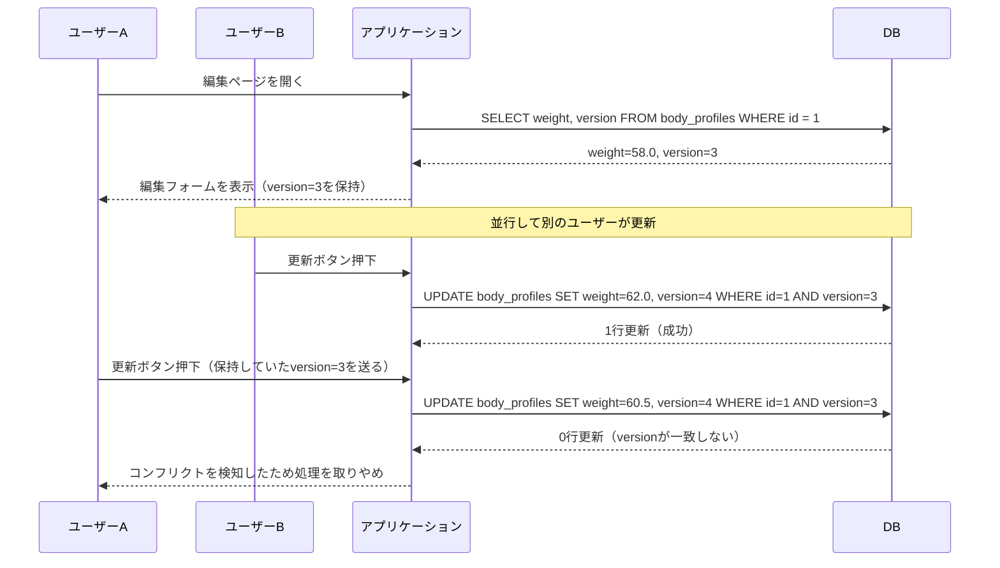
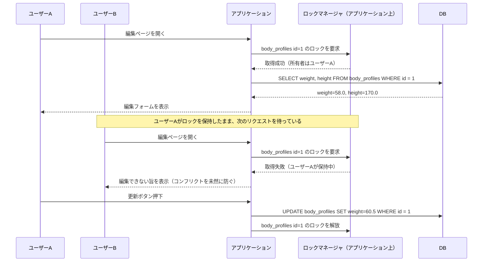

## リード文
連載の第三回は振る舞いのマッピングです。アプリケーションがひとまとまりとして扱いたい処理と、RDBが担保してくれるトランザクションの範囲は、しばしば食い違います。今回はそのズレをORMがどう埋めようとしてきたのか、そしてなぜそれが現代では限定的な役割にとどまっているのかを見ていきます。

## 第三回：振る舞いのマッピング
ORM連載の第三回です。ここまでの連載では、ORMの歴史をソフトウェア産業の歴史の中で振り返り、さらにトランザクションにおけるメモリ最適化の問題であるロード戦略について見てきました。
第三回の今回は、前回扱ったLazyロードを含む「振る舞いのマッピング」について考えます。

振る舞いのマッピングという言葉はソフトウェア業界内ですら十分に人口に膾炙した言葉とは言えません。マーチン・ファウラーの『エンタープライズアプリケーションアーキテクチャパターン』の中では「振る舞いに関する問題」として言及されており、オブジェクトに対してデータベースのデータをロードし、保存する方法^[邦訳は「さまざまなオブジェクトをデータベースに読み込ませる方法と保存させる方法である」。ただし、原文を読むと「That behavioral problem is how to get the various objects to load and save themselves to the database.」となっており、文脈から注釈元の内容と判断しています]と解説されています。そして具体的な技術として、ユニットオブワークとアイデンティティマッピング、そしてレイジーロードの3つが紹介されています。また、そこに関連する概念として並行性・オフラインロックにも言及があるため、本稿ではロックまでを含めて振る舞いのマッピングと呼びます。
これらはトランザクションに関する課題の解決として検討されてきたものですが、現代のORMでは役割を縮小させていることも特徴です。

以下ではORMとトランザクションの関係性について深掘りしていこうと思います。特に「なにを解決しようとしたか？」「どのように解決しようとしたか？」「なぜ限定的な役割にとどまっているのか？」の３点に焦点を当てながら、議論を進めます。

- なにを解決しようとしたか？
	- トランザクションの概要
	- トランザクションがなぜ問題になるのか
- どう解決するはずだったか
	- 詳細の解説
- なぜ限定的な採用なのか
- まとめ

## ORMはトランザクションのなにを解決しようとしたか？
### トランザクションとは？
詳細な議論に入る前に、トランザクションという概念について整理しておきましょう。以下にいくつかの学術論文をピックアップしておきました（リスト_1）。

リスト_1

| 年     | 論文名                                                                   | 概要補足                                 |
| ----- | --------------------------------------------------------------------- | ------------------------------------ |
| 1976年 | 『The Notions of Consistency and Predicate Locks in a Database System』 | トランザクションの定義、一貫性への言及、二相ロック、述語ロックなどの発案 |
| 1981年 | 『The Transaction Concept: Virtues and Limitations』                    | ACID特性のうちCADの整理、補償トランザクション           |
| 1983年 | 『Principles of Transaction-Oriented Database Recovery』                | ACIDの初出。DBの実装に関する細かい議論               |
| 1987年 | 『SAGAS』                                                               | ネストしたトランザクションへの対策としてサーガを提案           |

まず、一般的な定義として、トランザクションはいくつかの操作をまとめた処理で、ACID特性を持つとされています。ACID特性とは４つの単語の頭文字をとったもので、それぞれ以下の通りです。

- **原子性（Atomicity）**
	- トランザクションの処理は全てが実行されるか、全く実行されないかのどちらかである
- **一貫性（Consistency）**
	- 成功した各トランザクションは定義上、正当な（legal）結果のみをコミットする
- **隔離性（Isolation）**
	- トランザクション内の事象は、並行して走る他のトランザクションから隠されていなければならない
- **永続性（Durability）**
	- トランザクションがいったん完了し、その結果をデータベースにコミットしたなら、システムはそれらの結果がその後のいかなる不具合をも生き延びることを保証しなければならない

（『Principles of Transaction-Oriented Database Recovery』より抜粋したのち筆者訳）

この４つはソフトウェアエンジニアにとっては馴染み深いものでしょう。今回議論を進めるにあたっても上記の４つを前提とします。ただし、一貫性については補足が必要です。

### 一貫性はアプリケーション特性である

一貫性はACID特性を構成する要素ですが、４つの中では少し立ち位置が異なります。

体重管理のアプリケーションを題材に考えましょう。体重と身長を保存し、それらを元にBMIを算出・保存する処理があるとします。このとき、体重と身長だけが保存されBMIの計算結果は保存されないという事態は回避したいものです。トランザクションを導入することで、トランザクションのアトミック性により、体重・身長・BMIという３つの要素を全て同時に更新することが可能になります。
体重と身長が保存されるなら、BMIも更新されてほしい、というアプリケーション上で定義したルールこそが、一貫性です。

一貫性とはトランザクションによって担保したいデータ状態のルールです。これはDDDなどの文脈で言えばドメインルールと呼んでもいいかもしれません。
そしてこのとき、ACID特性のA・I・Dといった要素はトランザクションの成立要件といえますが、一貫性はトランザクションの目的に当たります。

『The Notions of Consistency and Predicate Locks in a Database System』（1976年）においては、以下のように触れられています。

> For this reason, the actions of a process are grouped into sequences called transactions which are units of consistency.
> このため、プロセスのアクションはトランザクションと呼ばれる列にまとめられる。トランザクションとは一貫性の単位である。

トランザクションとは、複数の処理をまとめたものであり、そのまとまりで一貫性を担保する、と書かれています。さらに直接的な言及をしている文章を『データ指向アプリケーションデザイン』から引用します。

> 原子性、分離性、永続性はデータベースの特性ですが、一貫性は（ACIDという考え方においては）アプリケーションの特性です

この通り、トランザクションを語る上で、一貫性は特殊な立ち位置にあります。

### ORMにおいてトランザクションのなにが問題になったか？
トランザクションというのは曖昧な言葉です。RDBが担保するトランザクションもあれば、複数リクエストに跨って処理されることを前提としたアプリケーションのトランザクションも存在します。後者のケースでは複数のリクエストにわたってRDBのトランザクションを貼っておくわけにもいきません。必然的にトランザクションを分割し、複数のシステムトランザクションでビジネス上の処理を表現することになります。

本稿における２つのトランザクションを整理しておきます。

- **システムトランザクション**：RDBなどが担保する処理のまとまり
- **ビジネストランザクション**：ビジネス上要求される一連の処理のまとまり

図にすると、ひとつのビジネストランザクションの中に複数のリクエストがあり、さらにその中に複数のシステムトランザクションがある、という入れ子の関係になります^[もちろん、複数のリクエストをまたぐシステムトランザクションを貼ることも可能です。]。

図1 - ビジネストランザクションとシステムトランザクションの関係


今回焦点を当てたいのは、1つのビジネストランザクションが複数のシステムトランザクションで構成されている、という点です。ビジネストランザクション単位で担保したい一貫性は、単純にシステムトランザクションを繋げるだけでは担保できません。システムトランザクションの合間には必ず一貫性の担保されない瞬間が生まれます。
ここで登場するのが、ファウラーのいう振る舞いのマッピングというわけです。

## どうORMはトランザクションの問題を解決するのか？
ここではファウラーの議論を追いかけます。どんな課題があり、振る舞いのマッピングがそれをどう解決することを期待されていたのかを見ていきましょう。

まず課題です。ビジネストランザクションでも、システムトランザクションと同じように一貫性が担保できればよい、というのが出発点になります。つまりはACID特性の担保なのですが、ここで整理が必要です。
実際に担保する必要があるのはAとIだけです。なぜでしょうか。
まず、前述の通り一貫性はトランザクションの目的であり、そもそもトランザクションとして担保する対象ではありません。そして永続性自体は、ひとたびコミットされてしまえばRDBが担保してくれると思っていてよいものです^[一旦キャッシュに入れて保持し、あとでまとめて保存する...などの例では、RDBへのコミットまで永続性を担保する必要があります。]。
必要になるACID特性は次の2つに絞られます。

- **A（原子性）**：更新処理が一度に終わること
- **I（分離性）**：他の更新から分離されていること

これをビジネストランザクション上で解決する——つまりはアプリケーションレイヤーで解決することが求められます。

では原子性と分離性の担保において、振る舞いのマッピングがどう役立つのでしょうか^[分離と不変というのも大切なのですが、今回は省略します]。ざっくりと役割を挙げると、図2のようになります。

図2 - 振る舞いのマッピングの分類


補足すると、ユニットオブワークは書き込み時の原子性の担保、オフラインロックが書き込み時の分離性の担保を行います。そしてそれ以外のLazyロードとアイデンティティマッピングは読み込みに有効なもので、直接的にACID特性の担保に役立つわけではありませんが、ビジネストランザクションを効率的に処理する上で重要な機能を提供しています。

続けて振る舞いのマッピングの詳細を見ていきます。
## 振る舞いのマッピング - 詳細
### ユニットオブワーク
ユニットオブワークはビジネストランザクションの処理をまとめてコミットするための仕組みです。通常のDBトランザクションが一定範囲の処理を一括でコミットするように、アプリケーション上のデータ操作を一括で行います。これによって、処理のアトミック性を担保しています。
ユニットオブワークの採用状況はORMによってまちまちです。例えばEloquentではユニットオブワークは採用されず、Doctrineでは採用されています。具体的なコード見比べてみましょう。
題材は先ほどの体重管理アプリです。身体情報（`body_profiles`）と算出結果のBMI（`bmi_records`）という2つのテーブルを、同時に更新するケースを考えます。

リスト1 - EloquentとDoctrineの更新操作の比較

```PHP
// Eloquent：更新の単位も、トランザクションの範囲も、書き手が明示する
DB::transaction(function () {
    $profile = BodyProfile::find(1);
    $profile->weight = 60.5;
    $profile->height = 170.0;
    $profile->save();               // ここで UPDATE body_profiles が飛ぶ

    $bmi = $profile->bmiRecord;
    $bmi->value = 60.5 / (1.70 ** 2);
    $bmi->save();                   // ここで UPDATE bmi_records が飛ぶ
});

// Doctrine：オブジェクトを書き換えるだけ。永続化の手順はORMが決める
final class BodyProfile
{
    private BmiRecord $bmiRecord;

    public function changeBody(float $weight, float $height): void
    {
        $this->weight = $weight;
        $this->height = $height;
        $this->bmiRecord->recalculate($weight, $height); // 一貫性はオブジェクト側で表現する
    }
}

$profile = $entityManager->find(BodyProfile::class, 1);
$profile->changeBody(60.5, 170.0);
$entityManager->flush();            // 変更されたオブジェクトを検出し、1つのトランザクションにまとめてUPDATEする
```

こうして見てみると、DoctrineがRDB操作の抽象化をしてくれているとわかります。Eloquentだと具体的なDB操作を意識しないといけないところが色々ありますが、Doctrineではオブジェクトを操作するようにコードを書くことができます。アトミック性も意識することなく達成されています。Eloquentでは自分で意識して書かないといけないところを、Doctrineは勝手にやってくれるわけです。

ビジネストランザクションのアトミック性という観点では、複数リクエストに跨った処理をユニットオブワークでアトミックにまとめる、という目的もありました。実際、『PoEAA』ではHTTPセッションでユニットオブワークを管理すると書かれています。
しかし現代のORMでこれを採用するケースは稀であり、リクエスト単位での管理をすることが多いです。Doctrineは「`EntityManager->merge()`」というメソッドを持っていましたが、この仕組みに起因する不具合が多く、最終的に削除されました^[参考：https://github.com/doctrine/orm/blob/3.6.8/UPGRADE.md#bc-break-remove-ability-to-merge-detached-entities, `$em->merge()`自体は前リクエストなどユニットオブワーク管理外の値をユニットオブワークにコピーするメソッド。コピー元がそのまま放置され不正な参照を招いたことと、コピーする際に条件次第で関連先のデータが保存されないなどの事故があった]。

### オフラインロック
続いてオフラインロックです。オフラインロックが担保するのはアプリケーションレベルでの分離性です。
分離性を実現する際の一般的な方法はデータベースレイヤーでのロックです。ただし、複数リクエストを跨ぐような長時間のロックは、並行する処理への影響が大きく好まれません。そこで登場するのがアプリケーションレイヤーでのオフラインロックになります。

今回紹介するのは楽観ロックと悲観ロックです^[『PoEAA』では緩ロックと暗黙ロックも扱われていますが、今回は余白が足りないので割愛します]。基本的な概念はデータベースレイヤーでの楽観／悲観ロックと変わりません。楽観ロックは保存時にコンフリクトの検知をしてロールバックするもので、悲観ロックはあらかじめロックを取ることでコンフリクトを防止します。
ただ、アプリケーション上に実装されるオフラインロックであるという点がデータベースレイヤーのロックとは異なります。先ほどの体重管理アプリの例を使い、「編集ページを開く→更新ボタン押下で保存」という２リクエストに分かれた処理を例に、楽観／悲観ロックをそれぞれ解説します。

#### 楽観ロック
楽観ロックは更新対象のテーブルのバージョンを保持しておき、並行処理による更新が入っていれば処理をとめ、更新がなければそのまま処理をコミットします。編集ページを開いたときに、身体情報テーブルのバージョンカラムの情報をアプリケーション上に保持します。そして更新ボタンを押下した際にバージョンカラムを比較し、並行する別の処理で更新が入っていなければコミット、更新されていれば処理を取りやめます^[細かなイメージは補足の記事を書いているのでそちらを参照いただけると幸いです：https://zenn.dev/levtech/articles/how-to-concrete-optimistic-lock]。

図3 - 楽観ロック


#### 悲観ロック
対して悲観ロックは更新対象をまずロックし、更新が完了するまで並行処理をブロックするものになります。データベースでの悲観ロックは比較的単純なのですが、アプリケーションレベルでこれを実現しようとする場合は複雑な機構が必要になります。まず編集ページを開いた時点で、ロックを管理するグローバルなオブジェクト上で身体情報テーブルへのロックを取得します。その後、更新ボタンが押下されるまで、このアプリケーション上のロック機構が他の処理をブロックすることになります。

図4 - 悲観ロック


このように、アプリケーションレベルでのオフラインロックを実装する場合、悲観ロックは複雑な処理が必要になります。『PoEAA』ではファウラー自身、アイデアの紹介のみにとどめており具体的な実装の紹介はしていません。現代のORMでも、アプリケーションレベルでの悲観ロックをサポートするケースは私の知る限り皆無です。
ではこのニーズへの対応がどうなったのかというと、ORMの標準的な機能として実装されるのではなく、ビジネス上の機能として採用されることが一般的なようです。例えば、編集中フラグを持たせてそもそも編集ページを開けなくしたり、保存ボタンを押せなくしたりします。ファウラーも悲観ロックをドメイン層に実装する^[「ドメインモデルに重オフラインロックを含めることは、悪い考えではない」　『エンタープライズアプリケーションアーキテクチャパターン』16.2 重オフラインロックより引用]と記載しています。
### Lazyロード
ここからは読み込みの問題です。
Lazyロードは、オブジェクトへのアクセスがあった段階で初めてクエリを発行して読み込むものです。直接的にはOOM回避のための仕組みで、詳細は前回解説済みなので割愛します。
振る舞いのマッピングの観点では、対象オブジェクトへのアクセス時に初めて対象行をロードする仕組みは、ロックを長時間・広範囲で取得することの防止にもなります。そのため、ビジネストランザクションを効率的に処理する上でも有用と言えるでしょう。

### アイデンティティマッピング
最後はアイデンティティマッピングです。アイデンティティマッピングは、データベースからロードしたデータの、アプリケーション上での一意性を担保する仕組みです。

通常、データベースから特定のレコードを読み込むと、取得したデータは都度オブジェクトに読み込まれます。リスト2を見てください。`obj_a`と`obj_b`はそれぞれRDBからロードされています。`obj_a`への更新は当然に`obj_b`へは反映されません。これはメモリ上での一意性が担保されないがために発生しています。
対してアイデンティティマッピングは、取得したデータの一意性をPKなどで担保します。これによって、例えば一度読み込んだオブジェクトは、改めてDBから取得しようとしても、一意マッピングがすでに読み込み済みのオブジェクトを返すようになります。

リスト2 - アイデンティティマッピング
```PHP
// 素朴にロードすると、同じ1行から別々のオブジェクトができてしまう
$sql = 'SELECT * FROM body_profiles WHERE id = 1';
$obj_a = $pdo->query($sql)->fetchObject(BodyProfile::class);
$obj_b = $pdo->query($sql)->fetchObject(BodyProfile::class); // 2回目もSQLが飛ぶ

$obj_a->weight = 60.5;

var_dump($obj_a === $obj_b);      // false：別インスタンス
var_dump($obj_b->weight);     // 58.0：$aへの更新は$bに反映されない

// アイデンティティマッピングがあると、同じオブジェクトが返る（Doctrine）
$obj_c = $entityManager->find(BodyProfile::class, 1);
$obj_d = $entityManager->find(BodyProfile::class, 1); // 2回目はSQLを発行せず、保持済みのオブジェクトを返す

$obj_c->changeBody(60.5, 170.0);

var_dump($obj_c === $obj_d);      // true：同一インスタンス
var_dump($obj_d->getWeight()); // 60.5：$aへの更新がそのまま見える
```

この仕組みはユニットオブワークの前提となっています。アトミックな処理を実現する上で、メモリ上でのデータの一意性管理が求められます。また、単一リクエスト上での並行処理を避けるという意味でも、一意なデータリソースをメモリ上に展開できるというのはメリットがあります。

『PoEAA』では、アイデンティティマッピングはログインセッション上で管理するとあります。セッション上で管理することで複数のリクエストを跨いで一意なオブジェクトの管理をし続けるという考え方です。一方、現代のORMでは単純さが優先されリクエスト単位にサーバーメモリ上で管理する手法がよく取られているようです。

## なぜORMは限定的な役割にとどまるのか？
以上で振る舞いのマッピングの解説はおしまいです。実装に深く踏み込むことはしていませんが、その動機と思想をお伝えすることはできたのではないでしょうか。
また、本文中でも触れていた通り、振る舞いのマッピングの採用状況はORMごとにまちまちなのが実情です。ユニットオブワークは複数リクエストを跨ぐことはせずRDB操作の抽象化にとどまることがほとんどで、悲観ロックはほぼ採用されていません。
なぜ振る舞いのマッピングが積極的に採用されていないのかというと、それはひとえにトランザクションの問題が一貫性の問題に関わるからでしょう。ビジネスにおける一貫性をどう担保するか？　というのはドメインの設計に深く関係する部分になります。ミドルウェアとドメインの結合性を高めるような仕組みはアプリケーションの持続性ある管理の上で問題になることも多く、ドメインレイヤーで解決する手法が好まれたのだと筆者は考えています。
その代わり、アプリケーションのデザインパターンとして、DDDの集約やCQRS/ESといったアイデアが登場しています。集約についてはファウラーも『エンタープライズアプリケーションアーキテクチャパターン』の中^[16.3 緩ロックにて。集約ルートへのロックでロックを実現する方法]で紹介しており、当時から振る舞いのマッピングとの関連が語られてきたことがわかります。

## おわりに
今回は振る舞いのマッピングに着目し、ORMどのようにビジネストランザクションの解決を試みたかを見ていきました。このような試みは、現代ではドメインの問題として処理されています。
このドメインの問題をアプリケーション上でクリーンに実装する際に問題になってくるのがアーキテクチャの問題です。ORMのアーキテクチャは歴史的にもアプリケーションのアーキテクチャ選定に影響を与えてきました。
次回はアーキテクチャとORMの歴史です。お楽しみに〜〜！！
