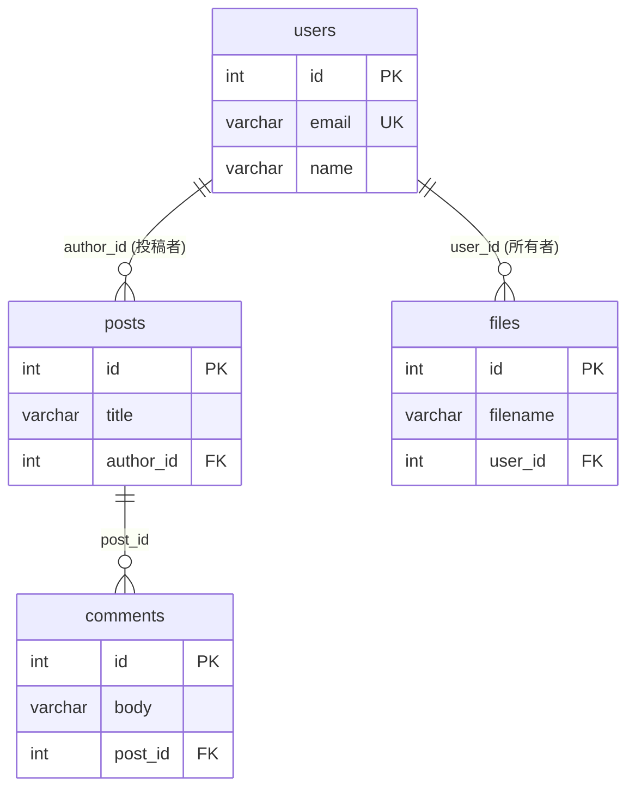
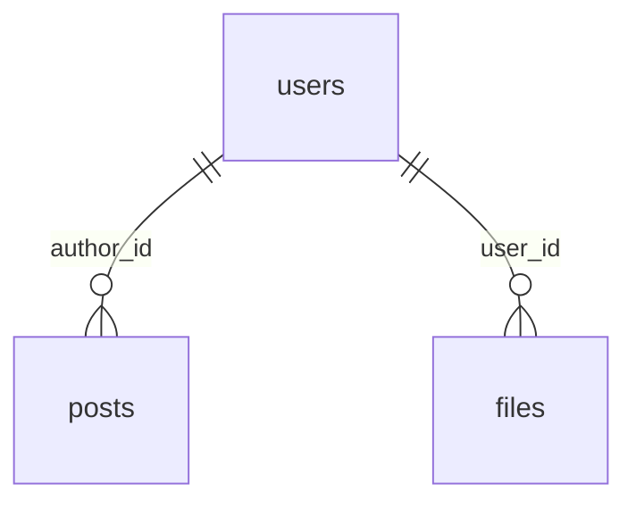

## これはなに
こんにちは、レバテック開発部のもりたです。
今回はJOINありのクエリを書くときにメモリオーバーなどの問題を引き起こすデカルト積問題について、実際にメモリ使用量を計測してどれくらい問題になりうるのか確かめてみました。

:::details 構成
### 構成
- デカルト積問題とは
- 計測
- 結果

最初に問題の解説、続いて計測、結果という流れです。それでは参りましょう。
:::
## デカルト積問題とは
デカルト積問題^[直積問題、と呼ばれることもあります。]とは、JOINクエリで想定外の巨大結果データセットが発生する問題で、アプリケーションサーバー上でのメモリ枯渇などを引き起こすこともある問題です。
以下に２つの似たようなクエリを用意しました。このうち片方だけが問題となります。

**クエリ1**
```SQL
SELECT *
FROM users u
JOIN posts p    ON p.author_id = u.id
JOIN comments c ON c.post_id  = p.id;
```

**クエリ2**
```SQL
SELECT *
FROM users u
JOIN posts p ON p.author_id = u.id
JOIN files f ON f.user_id   = u.id;
```

これらは似たようなクエリに見えますが、デカルト積問題として問題になるのは後者です。
クエリ1は、`users` - `oneToMany` - `posts` - `oneToMany` - `comments`という関係性です。それに対してクエリ2は`posts` - `manyToOne` - `users` - `oneToMany` - `files`という関係性です。`users`から`posts`と`files`の二つの子テーブルが生える形となっています。
これらの違いは図にするとわかりやすいです。

わかりやすい図_1
単純なtoManyクエリの連結だと組み合わせが限られるが、二股のtoManyだと直積になる、という図

このように、単純な親-子-孫という関係と、親に二つの子が結びつく関係では生まれる結果テーブルのレコード数が大きく異なります。これをデカルト積（直積）問題と呼んでいます。

そして、これを実際に計測してどれくらいヤバいのか見る、というのが今回の目的です。

## 計測するぞ〜〜
では計測していきましょう。
以下では利用するライブラリや環境、テーブル構造、計測コードなどを紹介します。
### ライブラリ、環境
- PHP 8.3.31
- Doctrine ORM 3.6.7（DBAL 4.4.3）
### テーブル構造
以下のようなテーブル構造です。


このうち、計測で使うのは以下の2本の経路です。

**連鎖（親子孫）— 問題にならない側**
`users → posts → comments` と一直線につながる関係。


**兄弟（二股）— デカルト積が起きる側**
`users` から `posts` と `files` の2本が生える関係。この2つを1クエリでJOINすると `posts × files` の直積になります。



それぞれの行数は以下の通り。

| テーブル名    | 行数      |
| -------- | ------- |
| users    | 1,000   |
| posts    | 10,000  |
| comments | 100,000 |
| files    | 10,000  |


### コード、計測方法
デカルト積問題の解説で使ったクエリをそれぞれ流し、どのタイミングでどれくらいのメモリを使ったのかを調べます。注意が必要な点としては、途中であえてORMの標準機能を使わずにPHPの配列で受ける処理とメモリ計測を入れている点です。PHPの配列で受けた箇所は本来消費しないメモリを消費しているので、参考値としてOKです。
コードは長いのでアコーディオンにしています。

:::details コード
#### コード
```PHP
#!/usr/bin/env php
<?php

// JOIN結果が「アプリサーバーのメモリに乗るまで」を段階分離して実測する。
// memory_get_usage(false)（＝生きてる実バイト、free で減る）で各段の増分を測る。
// 推測ではなく実数を出すのが目的。
//
//   docker compose run --rm app php bin/mem-breakdown.php [chain|sibling]
//     chain   : users → posts → comments   （和 = 分布不変）
//     sibling : posts ← users → files       （積の和 = デカルト積・分布敏感）
//
// 測る段：
//   ①-a MySQLバッファ … executeQuery した直後（まだfetchしていない）。mysqlndが持つ生バイト列。
//   ①-b PHP配列展開   … fetchAllNumeric でPHPの配列(zval)に展開した増分。ここで膨らむ。
//   ②   解放          … unset+GC で①が戻るか確認。
//   ③   UoWグラフ     … Doctrineがエンティティにハイドレーションして残す量。

use App\Entity\User;

$em       = require __DIR__ . '/../bootstrap.php';
$conn     = $em->getConnection();
$scenario = $argv[1] ?? 'sibling';

$mb = static fn (int $b): string => number_format($b / 1024 / 1024, 2) . ' MB';

// scenario → [ハイドレーション用DQL, 生の結果を全取得する生SQL（fetch-joinと同じ列）]
$map = [
    'chain' => [
        'SELECT u, p, c FROM App\Entity\User u JOIN u.posts p JOIN p.comments c',
        'SELECT u.*, p.*, c.* FROM users u JOIN posts p ON p.author_id = u.id JOIN comments c ON c.post_id = p.id',
    ],
    'sibling' => [
        'SELECT u, p, f FROM App\Entity\User u JOIN u.posts p JOIN u.files f',
        'SELECT u.*, p.*, f.* FROM users u JOIN posts p ON p.author_id = u.id JOIN files f ON f.user_id = u.id',
    ],
];

if (!isset($map[$scenario])) {
    fwrite(STDERR, "scenario は chain | sibling のいずれか\n");
    exit(1);
}
[$dql, $rawSql] = $map[$scenario];

gc_collect_cycles();
$m0 = memory_get_usage(false);

// ①-a MySQLから来た生バイト列（mysqlndの内部バッファ）。
//     PDOは既定でバッファドクエリなので、executeQuery した時点で全行がここに乗る。
//     まだ fetch していない = PHPの配列にはなっていない。
$stmt = $conn->executeQuery($rawSql);
$m1   = memory_get_usage(false);

// ①-b PHPの配列(zval)に展開。バッファは $stmt 側にまだ残るので、この増分は「配列化ぶん」だけ。
$rows    = $stmt->fetchAllNumeric();
$m2      = memory_get_usage(false);
$rawRows = count($rows);

// ② 解放して戻るか確認（バッファも配列も捨てる）
unset($rows, $stmt);
gc_collect_cycles();
$m3 = memory_get_usage(false);

// ここまでのピーク（①-b の配列展開を含む足場ぶん）を控えておく。
// ※ false(=生きてるemallocバイト)で測る。true(OSプール)は借りたら返さずstickyに残るので、
//    このあと③のピークをリセット計測する際に前段のプールが混ざって使えない。
$peakWithArray = memory_get_peak_usage(false);

// ピークの高水位をリセット（PHP 8.2+）。生セットは②で解放済み(false基準でbaselineに復帰)なので、
// ここから③だけを走らせれば「配列展開を通らないDoctrine経路の素のピーク」が測れる。
memory_reset_peak_usage();

// ③ オブジェクトにハイドレーション（UoWに載る）
$objs = $em->createQuery($dql)->getResult();
$m4   = memory_get_usage(false);

$peakHydrate = memory_get_peak_usage(false);

echo "scenario                 : {$scenario}\n";
echo "生の結果行数             : " . number_format($rawRows) . "\n";
echo "①-a MySQLバッファ実測    : " . $mb($m1 - $m0) . "   ← mysqlndが持つ生バイト列（コンパクト）\n";
echo "①-b PHP配列展開の増分    : " . $mb($m2 - $m1) . "   ← fetchAllNumericでzvalに膨張\n";
echo "②  unset+GC後の残り      : " . $mb($m3 - $m0) . "   ← ~0 なら生セットは解放済み\n";
echo "③  UoWグラフ実測         : " . $mb($m4 - $m3) . "   ← ハイドレーション後に残るエンティティ群\n";
echo "    エンティティ数       : " . number_format($em->getUnitOfWork()->size()) . "\n";
echo "ピーク: 配列展開込み(false): " . $mb($peakWithArray) . "   ← ①-b(fetchAllNumeric)の足場を含む\n";
echo "ピーク: ③のみ(false)     : " . $mb($peakHydrate) . "   ← 配列展開を通らないgetResult()だけのピーク\n";


```

#### 計測に使う関数の紹介
- `memory_get_usage(bool $real_usage = false)`
	- この関数の実行時にメモリが使用しているバイト数を返す
	- 引数がtrueだとPHPがOSから借りたサイズ（2MB単位、借りても返さないから実質ピーク時容量）で、falseだとPHPが使った実サイズ。
- `memory_get_peak_usage(bool $real_usage = false)`
	- 実行プロセスのライフサイクルの中でもっとも利用された時の使用量を返す
	- trueだとOSから借りたサイズ（2MB単位）で、falseは実際にPHPが使った量
- `gc_collect_cycles()`
	- 循環参照しているメモリを強制回収する関数。無駄な参照を消せる
- `$em->getUnitOfWork()->size()`
	- 管理中エンティティの総数を返します
:::

## 結果
結果はこうでした。

| No  | 項目                       | chain（連鎖: users→posts→comments） | sibling（デカルト積: posts←users→files） |
| --- | ------------------------ | ------------------------------- | --------------------------------- |
| 1   | 生の結果行数                   | 100,000                         | 644,600                           |
| 2   | ①-a MySQLバッファ実測（バイナリデータ） | 11.12 MB                        | 63.47 MB                          |
| 3   | ①-b PHP配列展開の増分           | 54.81 MB                        | 350.51 MB                         |
| 4   | エンティティ数                  | 111,000                         | 21,000                            |
| 5   | ③ UoWグラフ実測               | 128.47 MB                       | 32.54 MB                          |
| 6   | ピーク: 配列展開込み(false)       | 69.12 MB                        | 417.17 MB                         |
| 7   | ピーク: ③のみ(false)          | 156.54 MB                       | 102.36 MB                         |

考察しましょう。
### SQL結果行数は思ったほどにはメモリに影響していない
結果行数のデータ量を示すのは1, 2番です。連鎖が10万レコードであるのに対して、デカルト積は64万レコードであり、そのデータ量も大体同じだけ増えています。
一方、実際に処理場で扱える形となった5のUoWグラフではデータ量が逆転しています。これは、4のエンティティ数におおむね連動したデータ量です。
ここからわかることは、RDBから直接取得するデータ量としてはデカルト積問題は影響を及ぼすものの、アプリケーションサーバー上にオブジェクトの形で展開した場合は、UoWのエンティティ数のほうがより影響を与えている、ということです。
また、RDBから取得したバイナリデータを直接PHP配列に展開した場合(6)と比較して、UoWへの変換がだいぶメモリ使用量を絞れていることもわかります。これは、DoctrineがラップするDBAL^[クエリ発行などをするライブラリ]がRDBからの結果セットをカーソル的に1レコードずつ処理してUoWエンティティに変換しているおかげです。
### 1レコードあたりのデータ量が増えると影響がデカくなる
では、いうほどデカルト積は問題じゃないのかというとそういうわけではなく、例えば１レコードあたりの重たさが増えるとDBから取ってくる時のダメージはより大きくなっていきます。例えば今回の例ですと、postsの10,000レコードにそれぞれ10KBのテキスト(日本語3000文字超くらい)が乗った場合、それが生の結果行数の分だけ膨れ上がります。2のMySQLから受けるバイナリデータ換算で、chainは1GBの増量となりますが、6.4GBの増量となります^[あってる？　あってるよね？]。
特に今回の検証ではほぼIDだけのテーブルで検証していたためデカルト積の影響は少なく済みましたが、実際の運用に乗るデータで検証した場合はデカルト積の影響は大きくなるであろうことが予測されます。
### 気をつけたいのは２点
というわけで気をつけたいのは２点あったかなと思います。

**①: 1レコードあたりのデータ量がそれなりにある状態でデカルト積を起こすとやばそう**
**②: エンティティ数も気にしないと、オブジェクトに展開した時に痛い目を見る**

その他だと、Doctrine以外、PHP以外のORMだとまた動きは違いそう、みたいなことも思いました。

## おわりに
以上で検証は完了です。
実測って楽しいですね！　皆さんもぜひいろんなデータを読み込んでは計測してみてください。私はこの検証中に何度かトバしましたよ〜^[PHPのデフォルトメモリは128MBなので、余裕で飛びました]！


