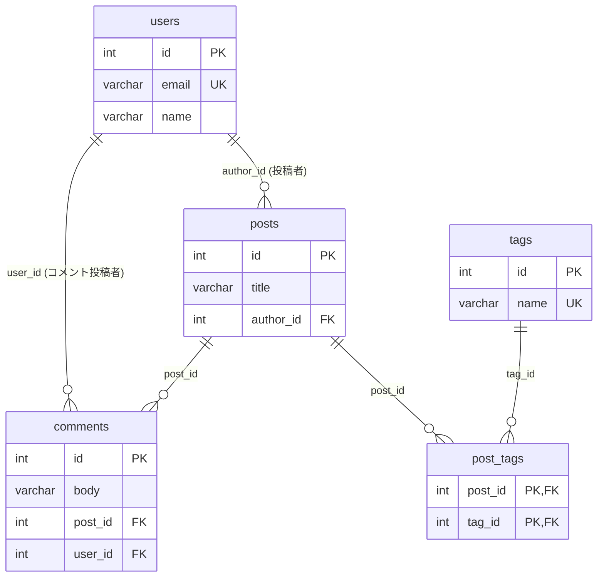

## これはなに
こんにちは、レバテック開発部のもりたです。
今回はJOINありのクエリを書くときにメモリオーバーなどの問題を引き起こすデカルト積問題について、実際にメモリ使用量を計測してどれくらい問題になりうるのか確かめてみました。

:::details 構成
### 構成
- デカルト積問題とは
- 計測
- 結果

最初に問題の解説、続いて計測、結果という流れです。それでは参りましょう。
:::
## デカルト積問題とは
デカルト積問題^[直積問題、と呼ばれることもあります。]とは、JOINクエリで想定外の巨大結果データセットが発生する問題で、アプリケーションサーバー上でのメモリ枯渇などを引き起こすこともある問題です。
以下に２つの似たようなクエリを用意しました。このうち片方だけが問題となります。

**クエリ1**
```SQL

```

**クエリ2**
```SQL

```

これらは似たようなクエリに見えますが、デカルト積問題として問題になるのは後者です。
クエリ1は、`テーブル1` - `oneToMany` - `テーブル2` - `oneToMany` - `テーブル3`という関係性です。それに対してクエリ2は`テーブル2` - `manyToOne` - `テーブル1` - `oneToMany` - `テーブル3`という関係性です。テーブル1から二つの子テーブルが生える形となっています。
これらの違いは図にするとわかりやすいです。

わかりやすい図_1
単純なtoManyクエリの連結だと組み合わせが限られるが、二股のtoManyだと直積になる、という図

このように、単純な親-子-孫という関係と、親に二つの子が結びつく関係では生まれる結果テーブルのレコード数が大きく異なります。これをデカルト積（直積）問題と呼んでいます。

そして、これを実際に計測してどれくらいヤバいのか見る、というのが今回の目的です。

## 計測するぞ〜〜
では計測していきましょう。
以下では利用するライブラリや環境、テーブル構造、計測コードなどを紹介します。
### ライブラリ、環境
- PHP
- Doctrine
### テーブル構造
以下のようなテーブル構造です。

それぞれの行数は以下の通り。

| テーブル名     | 行数  |
| --------- | --- |
| users     |     |
| posts     |     |
| comments  |     |
| post_tags |     |
| tags      |     |


### コード、計測方法
デカルト積問題の解説で使ったクエリをそれぞれ流し、どのタイミングでどれくらいのメモリを使ったのかを調べます。
コードは長いのでアコーディオンにしています。

:::details コード
#### コード
```PHP
#!/usr/bin/env php
<?php

// 生の結果セットとハイドレーション後のUoWグラフを、
// memory_get_usage(false)（＝生きてる実バイト、free で減る）で段階的に実測分離する。
// 推測ではなく実数を出すのが目的。
//
//   php mem-breakdown.php [tags|comments|cartesian]

use App\Entity\Post;

$em       = require __DIR__ . '/../bootstrap.php'; // 前提となる処理をやるファイル。Doctrineの呼び出しなど
$conn     = $em->getConnection();
$scenario = $argv[1] ?? 'cartesian';

$mb = static fn (int $b): string => number_format($b / 1024 / 1024, 2) . ' MB';

// scenario → [ハイドレーション用DQL, 生の結果を全取得する生SQL（fetch-joinと同じ列）]
$map = [
    'tags' => [
        'SELECT p, t FROM App\Entity\Post p JOIN p.tags t',
        'SELECT p.*, t.* FROM posts p JOIN post_tags pt ON pt.post_id = p.id JOIN tags t ON t.id = pt.tag_id',
    ],
    'comments' => [
        'SELECT p, c FROM App\Entity\Post p JOIN p.comments c',
        'SELECT p.*, c.* FROM posts p JOIN comments c ON c.post_id = p.id',
    ],
    'cartesian' => [
        'SELECT p, c, t FROM App\Entity\Post p JOIN p.comments c JOIN p.tags t',
        'SELECT p.*, c.*, t.* FROM posts p JOIN comments c ON c.post_id = p.id JOIN post_tags pt ON pt.post_id = p.id JOIN tags t ON t.id = pt.tag_id',
    ],
];

if (!isset($map[$scenario])) {
    fwrite(STDERR, "scenario は tags | comments | cartesian のいずれか\n");
    exit(1);
}
[$dql, $rawSql] = $map[$scenario];

gc_collect_cycles();
$m0 = memory_get_usage(false);

// ① 生の結果セットを全部 PHP に載せる（fetchAllNumeric: 列名重複OK）
$rows    = $conn->executeQuery($rawSql)->fetchAllNumeric();
$m1      = memory_get_usage(false);
$rawRows = count($rows);

// ② 解放して戻るか確認
unset($rows);
gc_collect_cycles();
$m2 = memory_get_usage(false);

// ③ オブジェクトにハイドレーション（UoWに載る）
$objs = $em->createQuery($dql)->getResult();
$m3   = memory_get_usage(false);

$peak = memory_get_peak_usage(true);

echo "scenario             : {$scenario}\n";
echo "生の結果行数         : " . number_format($rawRows) . "\n";
echo "① 生の結果セット実測 : " . $mb($m1 - $m0) . "   ← 全行をPHPに載せた増分\n";
echo "② unset後の残り      : " . $mb($m2 - $m0) . "   ← ~0 なら生セットは解放済み\n";
echo "③ UoWグラフ実測      : " . $mb($m3 - $m2) . "   ← ハイドレーション後に残るエンティティ群\n";
echo "   エンティティ数    : " . number_format($em->getUnitOfWork()->size()) . "\n";
echo "参考: ピーク(true)    : " . $mb($peak) . "\n";

```

#### 計測に使う関数の紹介
- `memory_get_usage(bool $real_usage = false)`
	- この関数の実行時にメモリが使用しているバイト数を返す
	- 引数がtrueだとPHPがOSから借りたサイズ（2MB単位、借りても返さないから実質ピーク時容量）で、falseだとPHPが使った実サイズ。
- `memory_get_peak_usage(bool $real_usage = false)`
	- 実行プロセスのライフサイクルの中でもっとも利用された時の使用量を返す
	- trueだとOSから借りたサイズ（2MB単位）で、falseは実際にPHPが使った量
- `gc_collect_cycles()`
	- 循環参照しているメモリを強制回収する関数。無駄な参照を消せる
- `$uow = $em->getUnitOfWork()->size()
	- 管理中エンティティの総数を返します


:::

- 結果
	- こんな結果に
	- デカルト積問題が実際に与える影響はこう
		- 今回の場合、mysqlndみたいなツールがバイナリデータで渡してくれてて、Doctrineの中にいるDBALがこれをカーソル的に一行ずつUoWに展開するので当初思ってたほどの大爆発には至ってない
	- 多分テーブルのカラム数が増えると影響がデカくなる
		- １レコードあたりの重たさが増えるとDBから取ってくる時のダメージがデカくなる
	- その他の考慮点
		- Doctrine以外、PHP以外のORMだとまた動きは違いそう
- 参考文献など


## 構成
- これは何
	- 今回はデカルト積問題の計測をしてみた
- デカルト積問題とは
	- この２つのクエリのうち、片方だけが問題になる 
		- 後者。一つの親に複数の子テーブルがあると、複数の子の全組み合わせが結果テーブルに乗ってくる
		- これがJOINのデカルト積問題と呼ばれてて、メモリを圧迫してOOMを引き起こしたりする
	- 実際のところ、どれくらいの影響があるんだ？　を検証するのが今回
- 計測するぞ〜！
	- 今回の前提
		- 利用ライブラリ、環境
			- PHP
				-  version幾つ？
			- Doctrine
				-  version幾つ？
		- こういうテーブル
			- ER図載せる
			- それぞれ何行
				- このリレーションとこのリレーションを比較します
		- このコードで計測
			- `code/doctrine/bin/mem-breakdown.php`
			- 計測関数の解説
- 結果
	- こんな結果に
	- デカルト積問題が実際に与える影響はこう
		- 今回の場合、mysqlndみたいなツールがバイナリデータで渡してくれてて、Doctrineの中にいるDBALがこれをカーソル的に一行ずつUoWに展開するので当初思ってたほどの大爆発には至ってない
	- 多分テーブルのカラム数が増えると影響がデカくなる
		- １レコードあたりの重たさが増えるとDBから取ってくる時のダメージがデカくなる
	- その他の考慮点
		- Doctrine以外、PHP以外のORMだとまた動きは違いそう
- 参考文献など


