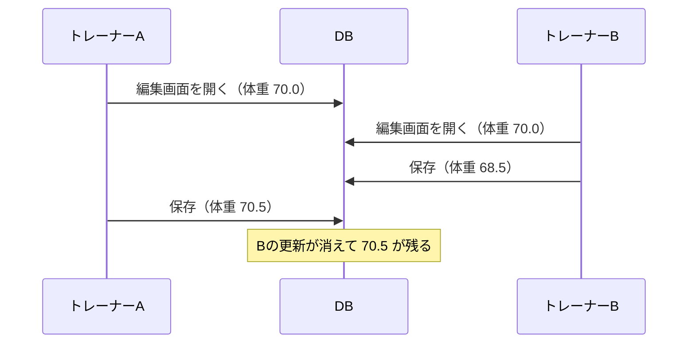
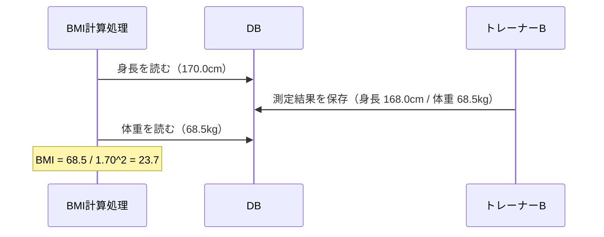
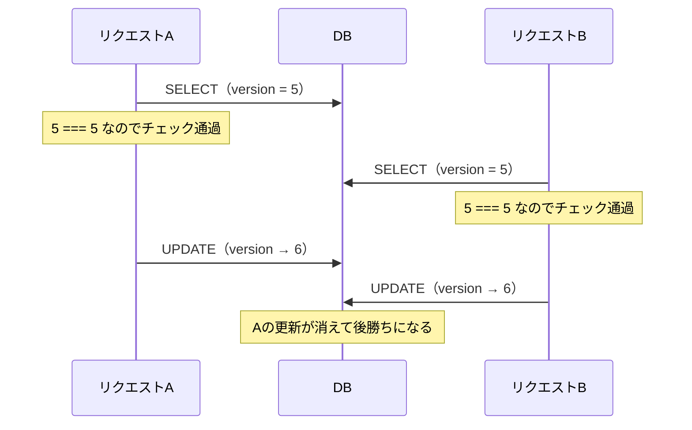

## これはなに
こんにちは、レバテック開発部のもりたです。
今回はアプリケーションを作る上でわりと出会う楽観ロックの実装方法についてまとめます。
コードの例はPHP/Laravelですが、基本的には言語やフレームワークに制限はありません。

:::details 構成
### 構成
- 楽観ロックとは
	- 課題
	- 楽観ロックによる解決
- 実装方法
	- 実装例
	- おさえたいポイント
- よくあるしくじり
- おわりに

概要、詳細、ミスったケースという流れです。それでは参りましょう。
:::


## 楽観ロックとは
楽観ロックは、複数クライアントによる並行処理から更新データを守る仕組みです。
と言ってもピンとこない人はピンとこないはずなので、まずは楽観ロックが解こうとしている課題から示します。

### 課題
例としてジムの会員管理システムを考えます。
会員の身長や体重を保持する`members`テーブルがあり、トレーナーが編集画面からそれを更新する、というよくあるやつです。

複数のトレーナーが同時に同じ会員を触る環境では、次の2つが問題になります。

#### 更新データの喪失
トレーナーAとトレーナーBが、同じ会員の編集画面を開いたとします。



Bは体重を68.5に直して保存しました。
そのあとAが保存すると、Aの画面が持っているのは画面を開いた時点の70.0を編集した値なので、Bの更新はAの更新によって上書きされます。
Bは自分の入力が保存されたと思っていますし、Aは誰かの入力を消したことに気付きません。
これが更新データの喪失です。

#### 一貫性のない読み込み
もう一つは読み込みの側で起きる問題です。
会員のBMIを計算する処理を考えます。
BMIは体重を身長の2乗で割った値なので、身長と体重の両方を読む必要があります。



計算に使われたのは、更新前の身長と更新後の体重です。
どちらの値も、単体で見ればDBに存在した値です。
しかし2つを組み合わせた時点で、どの時点にも存在しなかったBMIができあがります。
更新前の値だけで計算すれば24.2、更新後の値だけで計算しても24.3なので、23.7という結果はそのどちらでもありません。
これが一貫性のない読み込みです。

これら2つは、並行処理の下でデータの正確さが崩れる代表的なパターンです[^即応性]。
そして、これを解決する手段の一つが楽観ロックです。

[^即応性]: 並行性制御にはもう一つ、即応性、つまり並行処理があっても待たされずにデータを触れること、という軸があります。悲観ロックより楽観ロックが選ばれやすいのはこちらの理由です。

### 楽観ロックによる解決
楽観ロックは、処理に使うデータが更新されていたら処理をやめる仕組みです。
先ほどの例で言えば、Aが保存しようとした時点で「この会員のデータはあなたが画面を開いたあとに変わっています」と判断して、Aの更新を弾きます。
弾かれたAは画面を読み直し、Bの入力を踏まえた上でもう一度編集する。これが基本的な流れです。

:::details ロック以外に考えられること
#### ロック以外に考えられること
若干本筋からずれますが、並行性への対策としてロックを持ち出す前に検討できることが2つあります。

- 分離
	- 並行する利用者の間で、そもそもデータ領域を分けてしまう方法。同じレコードを複数人が触らない設計にできるなら、ロックを使う必要がなくなる
	- 例えば専属トレーナー制度にしてしまい、担当トレーナーしか利用者データをさわれないようにしておくなど
- 不変
	- データが書き換わらないなら、何人が並行して読んでも問題は起きません。読み取り専用にできるデータは守る必要がありません
	- 体重のデータは履歴でしか持てないようにしてしまうなど

ちなみに、ロックは分離の手法に当たります。トランザクションを張ることで他のプロセスからデータを分離する、という感じですね。
:::

:::details なぜDBのトランザクションでは足りないのか
#### なぜDBのトランザクションでは足りないのか
じゃあ素直にDBのトランザクションを使えばええやんけ、という疑問もでるかと思います。これができないのは、守りたい作業の単位とDBのトランザクションの単位がズレているためです。
例えば以下のようなケースではDBのトランザクションを張るのはお勧めできません。

- 編集画面を開いてから保存ボタンを押すまでに時間がかかる
	- その間ずっとDBのトランザクションを張り続けるのが難しい

つまり、ユーザーから見た1つの作業（編集画面を開いて、直して、保存する）は、DBから見ると別々のトランザクションに分かれています。このように、アプリケーション上で行われる一連の操作と、データベースで張られるトランザクションの粒度がズレる^[『エンタープライズアプリケーションアーキテクチャパターン』に詳しい。もしくはこちら：[Pessimistic Offline Lock](https://www.martinfowler.com/eaaCatalog/pessimisticOfflineLock.html)]時、楽観ロックなどの仕組みが必要となってくるわけです。
:::

## 実装方法
### 実装例
やることは2つです。

1. 編集画面を出すときに、レコードと一緒にバージョンを読んで画面に持たせる
2. 保存するときに、そのバージョンをWHERE句に入れてUPDATEし、更新行数が0ならコンフリクトとみなす

まず、テーブルにバージョンを持つカラムを足します。

```sql
CREATE TABLE members (
  id         BIGINT PRIMARY KEY,
  name       VARCHAR(100),
  height_cm  DECIMAL(4,1),
  weight_kg  DECIMAL(4,1),
  version    INT NOT NULL DEFAULT 1,
  updated_at DATETIME
);
```

`version`は更新のたびに1ずつ増える整数です。

編集画面を出すときは、表示する値と一緒に`version`を読み、hiddenフィールドなどに入れて画面に持たせます。

```php
$member = Member::findOrFail($id);
// $member->version をフォームのhiddenフィールドに埋め込む
```

保存時はこうです。

```php
$affected = Member::where('id', $id)
    ->where('version', $version)   // 画面表示時のversion
    ->update([
        'height_cm' => $input['height_cm'],
        'weight_kg' => $input['weight_kg'],
        'version'   => $version + 1,
    ]);

if ($affected === 0) {
    throw new OptimisticLockException();
}
```

WHERE句の`version`が肝です。
他の誰かが先に保存していればDBの`version`は進んでいるので、このUPDATEはどの行にもマッチせず、更新行数は0になります。
誰も保存していなければ1行更新され、同時に`version`が1つ進みます。

Eloquentには楽観ロックの標準機能がないため、この程度は自分で書くことになります[^doctrine]。

[^doctrine]: Doctrine ORMには`#[Version]`属性があり、バージョンの採番と比較をORMが引き受けてくれます。

### おさえたいポイント
上のコードは短いですが、押さえたい点が2つあります。判別とアトミック性です。

#### 判別
1つ目は、何をもって「更新された」と判断するかです。

`version`をこの用途に使えるのは、更新のたびに必ず値が変わり、しかも前の値に戻らないからです。
整数のインクリメントなので、精度の概念がなく、たまたま同じ値になることもありません。
判別に使う値には、この2つの性質が要ります。

#### アトミック性
2つ目は、比較と書き込みが1つの操作として実行されることです。

上のコードでは、`version`の比較（WHERE句）と書き込み（SET句）が1本のUPDATE文に入っています。
InnoDBはUPDATEの対象行に排他ロックを取り、先行するトランザクションがコミットするのを待ってから、最新の値でWHERE句を評価し直します。
そのため、比較を通過してから書き込むまでの間に他のリクエストが割り込む余地がありません。
比較と書き込みが別の文に分かれた瞬間、その隙間が生まれます。

## よくあるしくじり
ここまでの2点を外した実装をたまに見かけます。
どちらも実運用ではほとんど動いてしまうので気付きにくいのですが、あえて厳密にやらない理由もないという程度の話として読んでください。

### updated_atでコンフリクトを判断する
1つ目は、`version`を足さずに既存の`updated_at`で判断する実装です。判別のしくじりにあたります。

多くのテーブルにはもともと`updated_at`があるので、これを使えばカラムを足さずに済みます。
画面表示時の`updated_at`を持たせておき、保存時にDBの値と比較する、という発想です。

ただ、`updated_at`は時刻なので精度があります。
カラムがDATETIME（秒精度）だったり、比較を`Y-m-d H:i:s`形式の文字列で行っていたりすると、1秒より短い間に起きた更新を取りこぼします。

```
10:30:00.100  トレーナーBが編集画面を開く（updated_at = 10:30:00）
10:30:00.500  トレーナーAが保存         （DBのupdated_at = 10:30:00、同じ秒）
10:30:00.900  トレーナーBが保存
              → 画面が持つ値 10:30:00 === DBの値 10:30:00 → 一致とみなす
              → Aの更新が黙って上書きされる
```

競合を検出するための仕組みが、1秒の窓の中では機能していません。
カラムをDATETIME(6)にして比較もマイクロ秒まで行えばこの窓は狭まりますが、狭まるだけです。
`version`にすれば精度という概念自体がなくなります。

### アプリケーション側でコンフリクトを検知してから更新する
2つ目は、比較をアプリケーション側でやる実装です。アトミック性のしくじりにあたります。

コードにするとこうなります。

```php
$member = Member::findOrFail($id);

if ($member->version !== $inputVersion) {
    throw new OptimisticLockException();
}

$member->weight_kg = $input['weight_kg'];
$member->version   = $inputVersion + 1;
$member->save();
```

読んで、比べて、問題なければ書くという流れです。
一見すると正しく見えますが、比較と書き込みが別の文に分かれています。



AもBも、比較した時点では`version`が一致しているのでチェックを通過します。
そのあと両方がUPDATEを投げ、後に投げたほうが勝ちます。
守りたかったはずの更新の喪失が、楽観ロックを入れた上で起きます。

ここで注意したいのは、これが`version`カラムを導入しても解消しないことです。
判別に使う値を`updated_at`から`version`に変えても、比較をアプリケーション側でやる限りこの隙間は残ります。
2つのしくじりは別々の問題なので、片方を直しても片方は残ります。

対策は、最初の実装例のようにWHERE句へ比較を押し込むことです。
更新前に何らかの検証をしたいなど、どうしてもアプリケーション側で判断したい事情があるなら、トランザクションを張って`lockForUpdate()`で行ロックを取ってから読む形にします。

## おわりに
楽観ロックの実装自体はUPDATE文1本で終わります。
ただ、判別に使う値の性質と、比較がアトミックかどうかの2点は、外していても普段は動いてしまいます。
動いているように見えて守れていない状態になりやすいので、実装するときはこの2つを確認してみてください。

以上！！