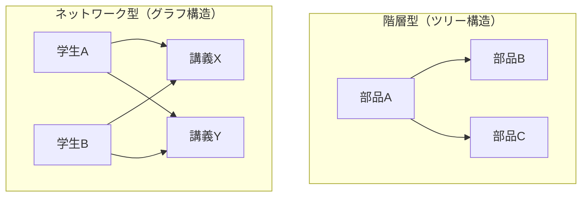
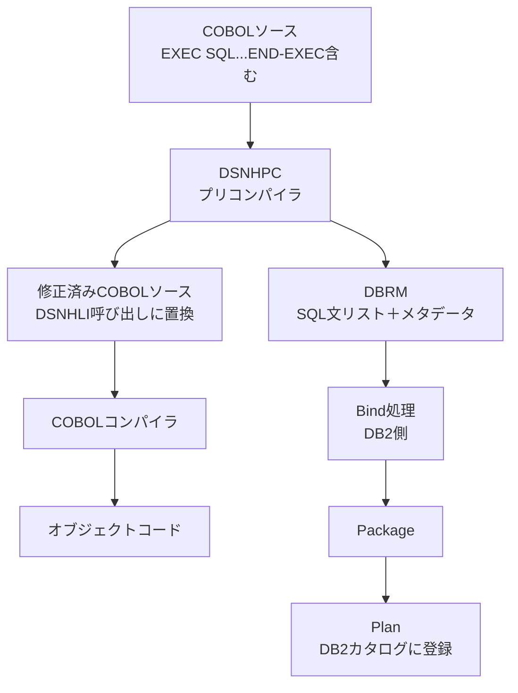
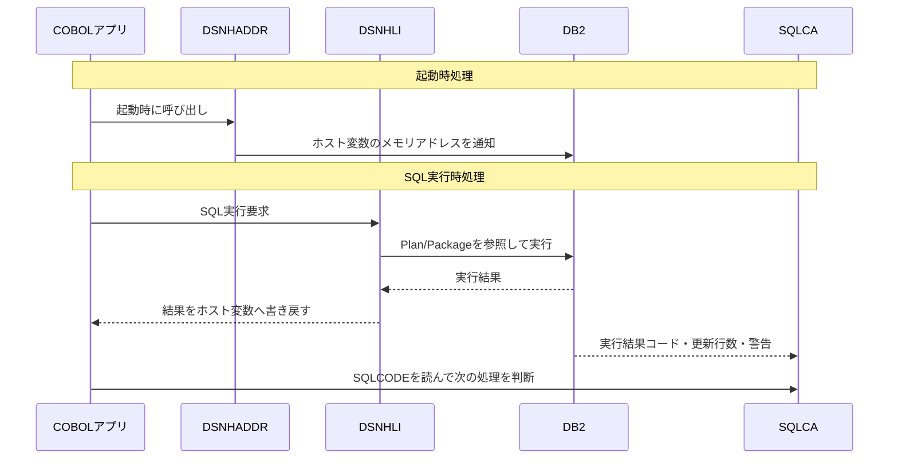

# はじめに

本シリーズ『人類が滅んでも使えるORM』をお手に取っていただきありがとうございます。

本シリーズは、ORマッパー（とその周辺領域）についての技術同人誌シリーズです。この本は当初、ORMの歴史から課題やコンポーネントの整理、そして実装までを扱う予定でしたが、あまりに範囲が広いため分冊版として少しずつ個人出版されることになりました。そのORMの歴史の**さらに**一部がこの書籍、というわけです。

ORマッパーというのは、RDBを扱うアプリケーションエンジニアには馴染み深い一方で、深く学ぶ対象としてはあまり見做されてきていない技術ジャンルです。なぜそんな技術にそれほどの執心をもって取り組むのか？　と思われた方のために、本書のねらいを続けます。

## データベースはアプリケーションと一緒にいるときに輝く

わたしはデータベース技術が好きです。いろんな技術があり歴史もあり研究する人も多い、一大技術領域と呼んで良いでしょう。わたしが思うに、この大変面白いデータベースがもっとも面白いのは、アプリケーションと一緒にいる時です。

削除フラグや外部キーといった話題は常にWebアプリケーションエンジニアの議論の的になります。データベース設計もみんなが好きです。曽根壮大さんの『失敗から学ぶRDBの正しい歩き方』や和田卓人さん翻訳の『SQLアンチパターン』、ミックさん著『達人に学ぶDB設計徹底指南書』など、参照すべき名著が多くある領域です。

以上でデータベースがアプリケーションと一緒にいる時にとても面白いという点については、一定納得いただけたかと思います。このジャンルには良い議論が多く、大変役に立つよい書籍があります。ただそのいっぽうで、大きな課題があるとも私は考えています。それは、**役に立つ書籍がある一方で、役に立たない書籍がない**ことです。

## 「役に立たない書籍」とは？

「役に立たない書籍」で扱う問題というのは、解決した問題のことを指します。私たちアプリケーションエンジニアは巨人の肩の上——多くのエコシステムの上に立って仕事をします。なかでもデータベースは歴史も長く枯れた技術であるため、乗っている巨人の身長も大変高いです。これらは普段意識されることなく、黙々と私たちの課題解決に貢献してくれています。

これらの技術は大変役に立っているのですが、その一方で、技術的な課題に対してある程度回答を出してしまい枯れてしまった技術についての知識は、あまり俎上にのぼることがありません。たとえばDBコネクションをどう実現するかというような解決されてしまった技術は、クエリチューニングのようなまだ解決されていない技術と比べて、論じられる回数が少ないです。

しかしわたしは、そのように解決され、一見普段の開発現場では役に立たないと思うような知識にこそスポットライトを当てたいのです。データベースとアプリケーションを取り巻く領域にはどんな課題があり、わたしたち人類がどのようにこれを解決してきたのかを知りたい。そこには二つの理由があります。

**①先人の知恵を知りたい**

まずは単純なところですが、先人がどのようにこれらの課題を解決したのか？　というのを深く知りたいからです。DeepDiveものや『〜を支える技術』といったシリーズに近い発想だと考えています。

**②議論の前提を取り払った状態で本質的な課題に触れたい**

もう一方の理由は少しややこしいのですが、わたしはそういった議論の前提を取っ払い、シンプルな世界で考えたとき、データベースとアプリケーションの間に横たわる本質的な課題がなんなのか？　というのをみてみたいのです。こういった自分自身が考える時の土台を知り、それを取っ払って考えることというのは歴史を学ぶときの醍醐味です。

## なぜ「人類が滅んでも」？

さて、そんな「枯れている」と言われ続けているデータベースですが、ここで軽く枯れていると言われる理由について想像を膨らませてみましょう。

枯れている理由はなぜなのか。データベースというのがとても便利で多くの人から使われているからというのもあるでしょう。技術的に魅力的で多くの技術者がこの領域で活動したというのもあるかもしれません。そしてより深い要因は、データベースの行う「永続化」がプリミティブな行為である、というポイントにあるのではないでしょうか。

この原稿を書いている2026年2月に、旧石器時代（約4万年前）の洞窟遺物の中から規則的な記号列が見つかったとの論文が発表されました。この論文の肝は、その記号列の情報密度がBC3000年ごろのメソポタミアで見つかった原楔形文字とほぼ同程度だったという点にあります。この原楔形文字は主に会計用途で使われていたとされており、羊の絵：数というようなkey:value型で情報が表現されていました。これは話し言葉ではありません。

興味深いのは、文字の発明よりも先に会計という行為があるという点です。私たちが教科書的な知識で知っている古代文明は、文字とともに生まれてきています。が、ここにきて、文字の発明やこれまでの文明概念よりも遥かに古い時代にデータベース的な発想があることがわかりました。カラム名、データ、レコードの概念、集計といった発想は私たちが思っているよりもプリミティブな概念であり、人類の行う本質的な行為であると言えるのではないでしょうか。

永続化レイヤー抽象化の取り組みとは、その普遍的でプリミティブなものに対して、私たちのつくったコンピュータ科学がどう挑むのか？　ということでもあります。
人類が滅んで、次の文明が地球に現れても、きっとORMは登場します。「人類が滅んでも使えるORM」という若干過激なタイトルはここからきています。この知識は実務ではあまり役に立たないかもしれませんが、次の人類が活かせる知識になるはずです。

## 今回扱う範囲：1980年代〜1990年代半ば
以上のような理由で、本シリーズでは歴史を大切にしながら、データベース系ミドルウェアが解決した課題とその解決方法を解説していきます。第一冊目の本書ではRDBの商用化からORM登場の前夜までを扱います。具体的には1982年から1996年あたりに展開したEmbedded SQLとODBC（Open Database Connectivity）というふたつの製品を解説します。これらはプログラミング言語がリレーショナルデータベースと接続する領域を初めて抽象化した製品であり、その後のORM登場の基礎となるものです。


# Embedded SQL
## この章の概要
 この章ではEmbedded SQLという技術について解説します。Embedded SQLはRDBの商用化とともに登場した、プログラミング言語とRDBを繋ぐ初めての技術です。まずはRDBの歴史を整理する中でEmbedded SQLの登場までを概観し、その後Embedded SQLの技術的な解説を行います。
 

## 第一節：RDBの登場とEmbedded SQLの歴史
この節では長い人類の歴史をRDBの誕生という観点で洗います。
これから解説する内容はざっくりと以下の年表にある通りです。

| 年        | 出来事                             |
| -------- | ------------------------------- |
| 1880     | ホレリスのパンチカード                     |
| 1960     | データバンク構想                        |
| 1964     | BDAM/ISAM（IBM OS/360）           |
| 1968     | IMS正式稼働                         |
| 1970     | コッドのリレーショナルモデル論文                |
| 1972     | VSAM                            |
| 1979     | Oracle Version 2（世界初の商用SQL-RDB） |
| 1982     | IBM DB2 + Embedded SQL          |
人類はとても古い時代からデータを記録してきました。本来であれば古代文明のはるか昔に記録された4万年まえの計量の痕跡から話を始めたいところですが、今回は古代文明の歴史は軽く触れるだけにとどめ、本格的な大規模データ処理が必要となった第10回アメリカ合衆国国勢調査から始めます。その後、本格的な電子式コンピュータが登場した1950年代を超え、1960年のデータバンク構想、そして多種多様な記録ツールの誕生を経て、RDBの誕生までをみていきたいと思います。
それではまず、データベースが生まれる前の時代から始めましょう。
### 1-1-1. 前データベースの時代

#### 記録の歴史、その始まり
人類がデータを記録してきた歴史は、想像を絶するほど古くから続いています。本書の冒頭で触れた4万年前の洞窟壁画をはじめとして、石板や粘土板、パピルス、羊皮紙、木管・竹管、そして紙へと、記録の媒体は時代とともに変化しながらも、「何かを書き留める」という本質的な行為は長く変わりませんでした。ではなぜ人類はデータを記録したいのか。それは「ある情報を後から参照したい・操作したい」というニーズがあったからです。この問いは数千年にわたって人類を動かし続け、やがてコンピュータという形へと結実することになります。
#### 1880年、大規模データ処理のニーズ
平面的な記録媒体に文字を永続化するという方法が、現代のコンピュータ科学に紐づくような形に姿を変えたのは、1880年代のアメリカでのことでした。

アメリカ合衆国は憲法制定後の1790年以来、10年に一度の国勢調査を行ってきました。ところが1880年に実施された調査では、その集計作業だけで実に8年を要してしまいます。当時のアメリカは移民の流入による人口増加が著しく、このままでは1890年の調査結果が出るころには次の調査の時期が来てしまうことは誰の目にも明らかでした。大規模データの高速な集計は、もはや国家的な急務でした。

この課題を解決すべく政府が広く解決策を求めたとき、名乗りを上げたのがコロンビア大出身の若き発明家、ハーマン・ホレリスでした。彼が提案したのは、機械式計算機とパンチカードを組み合わせた集計システムです。

ホレリスのパンチカードは、現代でいうところの「レコード」の概念そのものです。人間ひとりに関するデータを1枚のカードに穴の配列として記録し、それを機械が高速に読み取って集計する。このアイデアは劇的な効果をもたらし、8年かかっていた集計作業をわずか2年にまで短縮することに成功しました。

#### ホレリスの会社：ハードなソフトウェア
ホレリスはこの成功を足がかりにTabulating Machine Company社を設立します。その後複数の会社との合併を経て社と改名し、後継の社長が社名をInternational Business Machinesと変更しています。
この社名からわかる通り、1950年より前にホレリスの会社が扱っていたのはビジネスのための機器ーー今で言うところの複合機のようなオフィス用品でした。パンチカード読み取り機から始まり、タイムレコーダー、計算機、コーヒーグラインダーに至るまで、オフィスで使われる機械を幅広く手がけていたのです。

この会社はホレリスの時代以降も順調に業績を伸ばし、圧倒的なシェアを誇るようになります。電子式コンピュータの発明以降も勢いは続き、1970年代には汎用機を中心にコンピュータ産業のほぼすべてを掌握していたといっても過言ではありません。その後業界トップの座をMicrosoftに譲り渡しますが、現代でもホレリスの会社はその名を変えることなくInternational Business MachinesーーつまるところのIBM社として生き続けています。
IBM社がもともと「ビジネス用の機械屋」として出発したという事実は、コンピュータの歴史を理解する上で重要な視点を与えてくれます。つまりそれは、コンピュータ産業も長らくは工場と同じようなハードウェア的な発想の延長で動いていたと言う事実です。当時のソフトウェアはまだまだハードだったのです。

### 1-1-2. データベースの誕生
[[2026.3.20_DB誕生の整理]]
ここからはデータベースの歴史について考えてみましょう。
ホレリスの時代、データはパンチカードで保存していました。このパンチカードというものについて改めて考えてみると、これは記録媒体でありながら入出力のための媒体でもありました。カード一枚一枚がデータを保存するレコードでありながら、穴を開けることで入力を表現したり、データを読み取ることもできたというわけです。
パンチカードは当時の大量データを扱うという課題を解決しましたが、一方でいくつかの課題も持っていました。それは例えばカードがバラバラになると並び替えるのが大変であることや、単純に嵩張ってしまうことや、一度入力したカードはデータの書き換えが難しいことなどです。これらの特性は現代の記録媒体にはありません。なぜパンチカードにこれらの特性があるのかというと、それは入出力媒体としての利便性をとると、そうならざるを得ないから、という見方もできるでしょう。つまり、パンチカードはふたつの概念が混ざっているーーというより、ふたつの概念が未分化だった時代の記録媒体だった、とも言えるのではないでしょうか。
これを解決するため、いくつかの新しい記録媒体が登場しました。それは紙テープであったり、磁気ドラム、磁気テープ、磁気ディスクなどです。そしてそれら記録媒体が変化すると、その記録媒体に書き込む・読み取るためのシステムが必要となります。
#### ファイルアクセス：BDAM、ISAM、VSAM
そこで登場したのがファイルアクセス方式の仕組みです。IBMはOS/360の開発と並行して、1964年から1966年にかけてBDAM（Basic Direct Access Method）とISAM（Indexed Sequential Access Method）を導入しました。

BDAMはその名の通り、ディスク上のデータに直接アクセスするための基本的な方式です。一方ISAMは、インデックスを使ってデータへの高速な検索アクセスを可能にしました。レコードの追加や削除が多発するような業務では扱いにくい面もありましたが、読み込み中心のバッチ処理には十分な性能を発揮しました。

その後1972年から1973年にかけて、IBMのSystem/370向けにVSAM（Virtual Storage Access Method）が登場します。VSAMはBDAMやISAMの欠点を改善し、より柔軟なデータアクセスを実現しました。
これらのファイルアクセス方式は後続するデータベース管理システムのストレージ層としても活用されました。
#### 階層型・ネットワーク型データベースの登場
ファイルアクセス方式が確立されたのと同時期の1963年に、GeneralErectrics社のチャールズ・w・バッハマンによりIDS（Integrated Data Store）が発明されます。これはネットワーク型データベースであり、史上初めてのDBMSでした。ネットワーク型DBではナビゲーションという概念を持っており、エンティティ同士の関係性を定義したネットワーク上を物理ポインタを使って辿ることでアクセスしています。
なおバッハマンは博士号も持っておらず、完全に現場叩き上げの人物ですが、後にこれらの功績でチューリング賞を受賞することとなります。

それに続き、IBMはアポロ計画の部品管理という具体的な課題を解くため、IMS（Information Management System）を1968年に正式稼働させます。IMSは親子関係のツリー構造でデータを表現する階層型データベースであり、部品の構成表（部品Aは部品Bと部品Cからなる、という入れ子構造）の管理に威力を発揮しました。
一方で階層型の構造は、柔軟なデータの関係を表現するには限界がありました。現実のデータは必ずしも木構造に収まらないからです。たとえば「ある学生が複数の講義を受け、ある講義には複数の学生が所属する」というような、複数の親を持つ関係は階層型では自然に表現できません。



しかし、これらのデータベースにはある根本的な問題が残っていました。データの物理的な格納構造とアクセス方法が密接に結びついており、データの扱い方を変えたければシステム全体の再設計が必要になってしまうのです。「データをどのように格納するか」と「データをどのように検索するか」を切り離すことはできないか——この問いに答えたのが、次に登場するコッドの関係モデルです。

### RDBの誕生
#### リレーショナルモデルの誕生

こうした時代の流れのなかで、1970年にデータベースの歴史を大きく変える一本の論文が発表されます。IBMの研究員エドガー・F・コッドが著した「A Relational Model of Data for Large Shared Data Banks（大規模共有データバンクのためのリレーショナルデータモデル）」です。

コッドはこの論文のなかで、データを表（テーブル）として表現し、数学的な集合論に基づいて操作するというアイデアを提唱しました。階層型データベースのような固定された親子関係ではなく、テーブル同士を自由に結合できるこのモデルは、当時の常識を覆すものでした。データの物理的な格納構造を意識せずにデータを問い合わせられるという考え方は、その後のソフトウェア開発の在り方を根本から変えることになります。

しかし、リレーショナルデータベースの実用化には、意外にも時間がかかりました。

その背景には、IBMの置かれたビジネス状況がありました。当時のIBMは、階層型データベース「IMS」で市場に圧倒的なシェアを持っていました。IMSは多くの大企業に深く根付いており、IBMにとって重要な収益源でした。自ら新しいリレーショナルデータベース製品を商用化してしまうと、既存のIMS顧客を自分たちで掘り崩すことになりかねない。研究所でコッドの論文が生まれていても、それをすぐ製品として世に出すインセンティブが、IBMにはそれほど強くなかったのです。

#### 機会を見抜いたラリー・エリソン

この状況に目をつけたのが、のちにOracleを創業するラリー・エリソンでした。

エリソンは「IBM Journal of Research and Development」に掲載されたIBMの研究論文を読み、リレーショナルデータベースの試作研究の存在を知ります。そして論文を読み進めるなかで、あることに気がつきました。誰もまだこれを商用製品として市場に出していない、ということです。

エリソン本人はのちにこう語っています。「IBMが公開した研究論文をもとに、私たち4人がIBMより先に市場に出せるか試してみようと決めた。そして実際、そうした」。

こうして1979年、Oracle Version 2が発表されます。世界初の商用SQLリレーショナルデータベースの誕生でした。コッドが論文を発表してから約9年、研究成果をビジネスとして最初に形にしたのは、IBMではなく小さなベンチャーだったのです。

#### IBMの反撃とEmbedded SQLの登場

Oracleの商業的成功は、IBMに強い危機感を与えました。自社の研究から生まれたアイデアを他社に先行された形となったIBMは、ついにリレーショナルデータベースの製品化へと本腰を入れます。そして1982年、IBMはDB2の開発を本格化させ、1983年に製品としてリリースします。

このDB2をはじめとするリレーショナルデータベースが広まっていくなかで、ひとつの現実的な問題が浮かび上がりました。既存のCOBOLやFortranといったプログラミング言語から、どうやってRDBに接続するか、という問題です。当時のアプリケーションは独自の言語で書かれており、SQLという新しい問い合わせ言語を直接扱う仕組みがありませんでした。

この橋渡し役として生まれたのが、Embedded SQL（埋め込みSQL）です。既存のプログラミング言語のソースコード内にSQLを直接記述できるようにするこの仕組みは、RDBが普及するうえで欠かせない技術となりました。RDBの誕生と、それを実際のアプリケーション開発から使えるようにするための仕組みは、ほぼ同時期に生まれ、ともに発展していったのです。

第二節では、このEmbedded SQLがどのような仕組みで動いていたのか、具体的な構造と動作を詳しく見ていきます。

## 第二節：Embedded SQLの仕組み
### Embedded SQLの概要
ではここからEmbedded SQLについての解説を始めます。
Embedded SQL（埋め込みSQL）とはその名の通り、プログラミングソースの中にSQLを直接埋め込む手法です。主にCOBOL、C、Fortran、Adaなどの言語向けに提供されていました。

Embedded SQLのはざっくりと以下のような仕組みでアプリケーションとデータベースを協動させていました。

- SQLのソースコード埋め込み
- プレコンパイルによるSQLの変換
- 実行

このプレコンパイルによるSQLの変換というのがEmbedded SQLの一番の特徴です。Embedded SQLはSQLをソースコードの中に埋め込みますが、プレコンパイルによってその埋め込まれたクエリ内容をRDB側に送り、RDB側で実行可能なカタログに登録します。そしてそのカタログのリンクをソースコードに返却し、ソースコー上から追いかけられるようにすることで、ランタイムでの実行を可能にします。

それでは上記の３つのフェーズに分けて、詳細を掘り下げていきましょう。
以降、プログラミング言語としてCOBOL、RDBとしてDB2を題材に解説を行います。
### ソースコード埋め込み

Embedded SQLの最大の特徴は、その名の通り「SQLが別の言語の中に埋め込まれている」ことです。COBOLのプログラムは、通常のCOBOL文の合間に、区切りのマーカーで囲まれたSQL文を持つことができました。

そのマーカーが `EXEC SQL` と `END-EXEC` です。プログラマはこの二つのキーワードで囲まれた領域にSQL文を記述します。データを取得したいならSELECT文を、更新したいならUPDATE文を書く。そしてSQLの結果を受け取るためのCOBOL変数は、コロンを前置した `:変数名` という記法でSQL文の中から参照できました。

```cobol
WORKING-STORAGE SECTION.
01 WS-EMPID    PIC S9(9) USAGE COMP.
01 WS-EMPNAME  PIC X(25).

PROCEDURE DIVISION.
    MOVE 5 TO WS-EMPID
    EXEC SQL *> 開始キーワード *
        SELECT EMP_NAME
        INTO   :WS-EMPNAME *> 取得結果を変数に代入している *
        FROM   EMPLOYEE
        WHERE  EMP_ID = :WS-EMPID
    END-EXEC. *> 終了キーワード *
```
（`*>  *`はCOBOLのコメントアウト記法です）

このようにシンプルな書き方で、SQLを書くことができました。ただ、COBOLのコンパイラは、`EXEC SQL` と `END-EXEC` の間に書かれた文をまったく理解できませんので、SQLを含んだCOBOLのソースファイルをそのままコンパイラに渡せば、未知の構文があるとしてエラーになります。
この問題を解決するために設けられたのが、次に続くプレコンパイルという工程です。

### プレコンパイルによるSQLの変換
プレコンパイルはさらにいくつかの工程に分けることができます。以下の通りです。

- COBOL側のSQL文置き換え
- DBRMの生成とDB2への受け渡し
- DB2側でカタログ登録

#### COBOL側のSQL文置き換え
プレコンパイルは、本来のコンパイルよりも前に実行される、前処理の工程です。この工程を担う主役は、IBM DB2環境に付属するユーティリティ「DSNHPC」でした。

DSNHPCが最初に行うのは、ソースファイルを先頭から読み進めながら `EXEC SQL`〜`END-EXEC` のブロックを探し出すことです。見つけたSQL文は順番に番号付けして抽出されます。そしてその箇所には、SQL文そのものの代わりに、DB2との通信インターフェースである「DSNHLI」への関数呼び出しが埋め込まれます。`EXEC SQL SELECT ...` と書かれていた部分が、`CALL 'DSNHLI' USING ...` という形のCOBOL文に書き換えられるのです。

変換のイメージを示すと、次のようになります。

```cobol
* ── プレコンパイル前（開発者が書いたコード）──
    EXEC SQL
        SELECT EMP_NAME INTO :WS-EMPNAME
        FROM EMPLOYEE WHERE EMP_ID = :WS-EMPID
    END-EXEC.

* ── プレコンパイル後（DSNHPCが生成したコード）──
*   EXEC SQL ... END-EXEC はコメントアウトされ、
*   代わりにDSNHLIへの呼び出しが挿入される
    CALL 'DSNHLI' USING SQL-STMT-01, SQLCA, WS-EMPNAME, WS-EMPID.
```

これによってCOBOLから生のSQL文が取り除かれ、通常のコンパイルが可能になります。

DSNHPCが行う処理はここで終わりではありません。SQL文を抽出しながら、DBRM（Database Request Module）というもう一つの成果物も生成しています。

#### DBRMの生成とDB2への受け渡し

DBRMとは、プレコンパイルの過程でCOBOLソースファイル１本ごとに生成されるSQL文の集合体です。こちらはバイナリファイルのため実物をお見せすることはできないのですが、以下のような構成でした。

```
DBRM
├── ヘッダ情報
│   ├── プログラム名
│   ├── プリコンパイル日時
│   └── DBMSのバージョン情報
├── SQL文のテキスト（各SQL文ごと）
├── ホスト変数の情報
│   ├── 変数名
│   ├── データ型
│   └── 長さ
└── セクション番号（各SQL文の識別子）
```

こうして生成されたDBRMは、PDS（Partitioned Data Set）と呼ばれる記憶領域に保存され、続いてDB2側の処理へと引き渡されます。COBOLのコンパイルとは独立した経路で、DBRMはDB2のもとへと届けられることになります。

#### DB2側でカタログ登録

DBRMを受け取ったDB2側では、「Bind（バインド）」と呼ばれる処理が行われます。これはDBRMの中身を解析し、SQL文を実際にデータベース上で実行できる形に準備する工程です。

まずDBRMから個々のSQL文を取り出し、それぞれに対してアクセスパスの最適化と権限チェックが行われます。テーブルが存在するか、カラムの型は合っているか、実行ユーザーに必要な権限があるかなどを確認します。その後、最適化された実行計画とともにDB2のカタログに登録されたものが「Package（パッケージ）」です。1本のDBRMから1つのPackageが生成されます。

さらにPackageを束ねて、アプリケーションが実際に呼び出す単位として登録されるのが「Plan（プラン）」です。複数のPackageを集約し、実行時に直接参照される最終形態として機能します。DB2の初期（1982年頃）にはPackageという概念は存在せず、DBRMをPlanに直接バインドする形でした。PackageはDB2の成熟とともに1980年代後半に導入され、大規模な開発での管理性を向上させた概念です。

こうして、COBOL側のソースファイルとDB2側のPlanという、二つの成果物が揃って初めてプログラムを動かす準備が整います。プレコンパイルとは、一つのソースファイルを二つの経路に分岐させ、それぞれを別々の処理系に届ける工程だったといえます。



### 実行

プレコンパイルによってSQL文はアプリケーションのソースコードから分離され、DB2側にカタログとして登録されます。では、プログラムが実際に起動し、そのSQLを実行しようとするとき、舞台裏では何が起きているのでしょうか。

DB2のEmbedded SQL環境では、実行時に以下3つのコンポーネントが連携して動きます。

- DSNHADDR
- DSNHLI
- SQLCA
（DSNはDB2の開発時コードネームです。）

まずDSNHADDR（DSN Host ADDRess）はデータ領域の確保を行うコンポーネントです。プログラム内のホスト変数——COBOLであれば作業記憶域に宣言されたデータ項目——それぞれのメモリアドレスを確立する役割を担います。プログラムの起動時、あるいは最初のSQL実行の手前で呼び出され、「このデータはメモリのここにある」という対応関係をDB2側に伝えるための下準備をします。

続いてDSNHLI（DSN High Level Interface）は実際のSQL実行要求をDB2に送り届け、その結果を受け取るコンポーネントです。プレコンパイル済みのPlanやPackageを参照しながら、アプリケーション側が渡したホスト変数の値をDB2に伝え、実行後の結果セットをホスト変数へと書き戻します。エラー処理やリソース管理もDSNHLIが担います。

最後がSQLCA（SQL Communication Area）です。こちらはSQL実行の結果を受け取役割を果たしています。SQLCAはプレコンパイル時に自動的にプログラムへ組み込まれる構造体であり、SQL実行後の状態を伝えるための専用フィールドを持っています。SQLCODEと呼ばれる数値フィールドには実行結果コードが入り、ゼロであれば正常終了、100番であれば「対象データなし」、それ以外の負の値であればエラーを意味します。SQWARNには警告フラグが、SQLERRD(3)には実際に更新・挿入された行数が格納されます。アプリケーション側はSQL実行のたびにSQLCAを参照し、処理を継続するか中断するかを判断していました。

こうして見ると、Embedded SQLのランタイムは3層の連携として理解できます。ホスト変数の準備（DSNHADDR）、DB2への命令と結果の受信（DSNHLI）、そしてDB2からの応答の読み取り（SQLCA）。アプリケーション開発者はこの仕組みを直接操作することはほとんどなく、プレコンパイラが自動的に挿入したコードが内部で勝手に動くという設計でした。



### プレコンパイル方式の特性

Embedded SQLのプレコンパイル方式は、RDBとホスト言語を繋ぐ実用的な解法として広く採用されました。ここではそのメリットとデメリットを整理しましょう。

#### メリット
利点は明快です。SQL文は事前に解析・最適化されてPlanとして格納されるため、実行時に改めて構文解析や実行計画の生成を行う必要がありません。本番環境での実行は軽量であり、大量のバッチ処理を高速にこなすことができました。1980年代の業務システムが要求した安定性と性能という観点では、プレコンパイル方式は十分な答えでした。

#### デメリット
一方で、この方式には原理的な制限がありました。SQL文は事前に静的に定義されなければならないという制約です。

実行するたびに条件が変わるような動的なクエリ——ユーザーの入力に応じてWHERE句が変化するような処理——は、Embedded SQLのプレコンパイル方式とは根本的に相性が悪いものでした。SQL文はソースコードに固定され、コンパイル時に確定していなければならない。実行時に検索条件を組み立てるような柔軟な処理は、この枠組みのなかでは実現しにくかったのです。

さらに、実行計画の陳腐化という問題もありました。Planとして格納された実行計画は、データの量や分布が変化しても自動的には更新されません。テーブルのデータ量が数百件から数百万件に膨れ上がっても、かつて最適だった実行計画がそのまま使われ続けることがあります。パフォーマンスを維持するためには定期的にPlanやPackageを再バインドする運用が必要であり、それはシステム管理者にとって無視できない運用コストでした。

## 第一章のまとめ

リレーショナルモデルの誕生からDB2の登場まで、1970年代から1980年代初頭にかけてのRDB史を振り返ると、Embedded SQLが果たした役割の意味がより鮮明になります。

コッドの理論は美しく、SQLという問い合わせ言語は強力でした。しかし理論だけでは、既存のCOBOLやFortranのアプリケーション群はRDBと繋がることができなかった。Embedded SQLは、まさにその「繋ぎ」のために生まれた技術です。プレコンパイル方式というアイデアは、異なる言語仕様の世界を低コストで橋渡しするための、当時としては現実的かつ巧みな解法でした。

しかしその構造は、RDBが広まり、アプリケーションへの要求が多様化していくにつれて、徐々に限界を露呈していきます。静的なSQLの制約、実行計画の管理コスト、そしてRDBごとに微妙に異なる方言の問題——これらが積み重なるなかで、より汎用的なデータベースアクセスの仕組みへのニーズが高まっていきました。

次の第二章では、こうした課題に応えるかたちで登場したODBC（Open Database Connectivity）を取り上げます。特定のデータベース製品に依存せず、共通のAPIでRDBにアクセスするというODBCの設計思想は、Embedded SQLが抱えた問題をどう解決しようとしたのか。その歴史と仕組みを、引き続き見ていきましょう。

# 第二章：CLI/ODBCの登場

前章では、データベースの歴史をパンチカードの時代から辿り、リレーショナルモデルの誕生とEmbedded SQLの登場までを見てきました。Embedded SQLは、COBOLやFortranといった既存のプログラミング言語とRDBの間を繋ぐ橋渡し役として機能し、1980年代のエンタープライズ開発に欠かせない技術となりました。

しかしその構造は、時代とともに顕在化していくいくつかの限界を抱えていました。SQL文はソースコードに静的に固定され、実行時に内容を変えることはできません。またプレコンパイルの工程は特定のデータベース製品と強く結びついており、Oracle向けに書いたコードはDB2ではそのまま動かせません。この問題は、1990年代へ向けてシステムが複雑化していくにつれて、次第に無視できないものになっていきます。

本章ではその流れの先に登場したCLI（Call Level Interface）とODBC（Open Database Connectivity）を取り上げます。静的な埋め込みから、動的な呼び出しへ。特定ベンダーへの依存から、透過的なアクセスへ。この変化がなぜ起き、どのように実現されたのかを、まず時代背景から追っていきましょう。

## 第一節：ODBC登場までの歴史

### IBMの時代からMicrosoftの時代へ

1970年代初頭まで、コンピュータ産業はIBMが圧倒的に支配していました。大型の汎用機を中心に据えたシステムが企業の基幹業務を担い、IBMのハードウェアとソフトウェアがひとつの生態系として完結していました。この時代のソフトウェア開発とは、IBMのハードウェアとソフトウェアのエコシステムに全面依存することを意味していました。

その均衡が崩れ始めたのは、1970年代のパーソナルコンピュータブームです。当初のPCは回路を自分で組み立てる必要があるようなギーク向けの代物でしたが、1976年のApple I、そして1977年のApple IIの登場によってその状況が変わります。Apple IIには表計算ソフト「VisiCalc」というキラーアプリが登場し、コンピュータは一気に商業的な価値を持つ製品へと変貌しました。

遅れて1981年、IBMもPC市場に参入します。このときIBMはPC向けのOS開発を、当時まだ小さなソフトウェア会社ながらApple IIにBASIC言語を提供していたMicrosoftに発注しました。Microsoftはこれを急ピッチで開発し、IBM PCに提供します。そして重要な点は、MicrosoftがこのOSの著作権を手元に残し、ライセンス提供という形を選んだことでした。この判断によってMicrosoftは、IBM互換PCを製造する他のメーカーすべてに対しても同じOSを販売する権利を持つことになります。
ライセンス提供によって安定した収入源を得たMicrosoftは、IBM PC向けの次世代OS「OS/2」を開発するかたわらで、GUIを備えた独自OS「Windows」の開発を着々と進めていました。1985年のWindows 1.0から始まり、1990年のWindows 3.0、そして1992年のWindows 3.1で爆発的な普及を遂げます。一方のOS/2は1990年に開発責任の大半がIBMへ移り、翌1991年にはMicrosoftが撤退。両社の蜜月はここで終わりを迎えます。

1992年というのはMicrosoftとIBMにとって特別な年でした。WindowsはコンピュータのOSとして史上初の４ヶ月連続100万本の売り上げを達成し、創業者であるビル・ゲイツはパーソナルコンピュータ産業への貢献によりアメリカ国家技術賞を受賞しています。一方のIBMはその長い企業の歴史の中で初めての赤字転落となり、当時の米国企業史上最大の**49億6500万ドル**という損失を計上しています。

この明暗別れる結末は、コンピュータ市場におけるエンタープライズシステムの主流アーキテクチャを反映させたものでした。Windows 3.0前後から広まっていたのが、クライアントサーバー方式です。IBMの汎用機がすべてを握っていた中央集権型のシステムから、WindowsなどGUIを持つクライアントマシンがサーバーに接続して処理を分担するアーキテクチャへと、エンタープライズシステムの主流は移行していきました。

データベースはまさにこのサーバー側に位置していました。1980年代を通じてデータベース製品は多様化し、Oracle、IBM DB2、Sybase、Informixといった製品群が市場に並びます。そして1990年代に入るころには、ひとつの企業の中でも部署ごとにバラバラなデータベースを導入しているという状況が一般的になっていました。経理部門はOracle、在庫管理にはDB2、営業部門はSybase——そんな光景が大企業の現実だったのです。

### 動的クエリと複数DB横断という二つのニーズ

こうした変化は、Embedded SQL時代には存在しなかった二つのニーズを生み出しました。

ひとつは、動的なクエリへの要求です。GUIの普及は、ユーザーがインタラクティブに操作できるアプリケーションへの期待を高めました。Excelのような表計算ソフトがデータベースに接続してデータを引き出すような使い方を考えると、ユーザーが入力した内容に応じて検索条件が変わる「動的なクエリ」が不可欠です。しかしEmbedded SQLでは、SQL文はソースコードにあらかじめ固定されており、実行時に自由に組み替えることはできませんでした。

もうひとつは、複数のデータベースへの横串アクセスです。部署ごとに異なるDBが導入された企業では、システム全体を横断してデータを統合したいというニーズが生まれます。しかしEmbedded SQLはプレコンパイルの仕組み上、特定のデータベース製品と密接に結びついていました。Oracle用に書かれたEmbedded SQLプログラムを、そのままDB2で動かすことはできません。データベースを乗り換えたり複数のデータベースに同時にアクセスしたりするためには、接続の仕組みそのものを抽象化する必要がありました。

### CLI（Call Level Interface）の誕生

ここにSQLとSAGの関係性の図を入れる。SVGのやつ。

こうした課題に応えるための動きは、1989年にOracleやInformix、Ingres、Digital Equipment Corporation（DEC）、HP、Sun Microsystemsなどの主要ベンダーが集まって結成した「SQL Access Group（SAG）」から始まります。その目的は、データベースの移植性と相互運用性を実現するための標準仕様を策定することでした。

SAGは1990年からCLI（Call Level Interface）の開発を始め、1992年にはX/OpenとともにCLIのスナップショット仕様を公開します。CLIは仕様であって製品ではありません。データベースベンダーが従うべきAPIの設計を定め、各社がそれぞれの製品向けにライブラリとして実装する——というモデルが想定されていました。

CLIがEmbedded SQLと根本的に異なるのは、プレコンパイルという工程を必要としない点です。Embedded SQLでは、SQL文をプログラムに「埋め込む」ために専用のプレコンパイラを経由する必要がありました。CLIでは、SQL文は通常の文字列としてプログラム内に書かれ、関数呼び出しを通じてランタイムに渡されます。静的に固定された埋め込みから、動的な呼び出しへの転換です。

標準化の流れはその後も続き、X/Openは1994年にCLI予備仕様を、1995年には正式仕様（CAE）を発行します。さらにISOもこの流れと協調して国際標準化を進め、1995年から1996年にかけてISO CLI標準が確定します。SAGは1994年末にX/Openへ統合・解散し、翌1996年にX/OpenとOSF（Open Software Foundation：Unix系OSの標準化を推進した業界団体）が合併してThe Open Groupが発足します。一つの仕様が、こうした標準化団体の連鎖を経て国際標準へと昇格していきました。

### MicrosoftによるODBC実装

CLIという仕様の策定に参加した組織のひとつがMicrosoftでした。Microsoftは1992年のスナップショット仕様公開に貢献しながら、同年、自らCLI仕様を実装した製品「ODBC 1.0」をWindowsプラットフォーム向けにリリースします。ODBCとはOpen Database Connectivityの略です。名前の通り「データベース接続をオープンに」という思想が名称に込められています。

ODBCはCLI仕様をそのまま実装するのではなく、独自に拡張した三層構造を採用しました。

- コア層：SAGとISOのCLIに準拠した最小限の機能
- レベル1：スクロールカーソル、ストアドプロシージャ呼び出し、ROLLBACKを含む本格的なトランザクション管理など、実務に必要な機能が加わった
- レベル2：バルク操作や分離レベルの変更といった、より高度な機能が定義されている

レベル1・2はMicrosoftが実務の要求に応えるために独自に定義した拡張です。また、それ以上に特徴的な拡張として、ODBCでは透過的アクセスを実現していました。CLI仕様では各データベースベンダーがライブラリを提供し、利用者がそれを選んで使うという形でした。そのため、利用者はどのデータベースでも同じような使用感で使えた一方で、データベースを切り替えて使う際は別のライブラリを呼ぶようにコードを書き換える必要がありました。しかしODBCは設定ファイルに接続するデータベースを指定するだけで、コード自体は修正することなく利用することが可能でした。

これは当時の「部署ごとに異なるDBが導入され」「システム全体を横断してデータを統合」したい企業にとってはとても都合の良いものでした。ODBCが普及するということは、どのデータベース製品を使っていてもWindows上で動くアプリケーションから一貫してアクセスできる環境が整うということです。ODBCの普及は、Windowsというプラットフォームの価値を高めることになりました。
データベースそのものを持たないMicrosoftにとって、特定のDB製品への依存を薄める標準の推進は、競合他社（OracleやDB2）との利害葛藤が薄く、むしろ積極的に進める理由がありました。SAGの初期メンバーだったOracle、Informix、Ingresといったデータベースベンダーは、移植性標準の推進において「自社製品の優位性を失う」というジレンマを抱えていましたが、Microsoftにはそのジレンマがなかったのです。

その後、1994年にはODBC 2.0がリリースされ、コア層がSAG CLIとより整合する形に改訂されます。同年、Microsoftは非Windows環境への移植の独占ライセンスをVisigenicという企業に供与します。そして1995年のODBC 3.0では、ISO CLI標準とSAG CLI仕様の両方に完全に整合する形となり、ODBCは事実上の国際標準と呼べる位置へと到達しました。

## 第二節：ODBCの仕様と使い方
ここからは、ODBCの仕様と、実際の使い方をみていきたいと思います。以下で紹介するのは1995年にリリースされたODBC3.0の実装です。

### 仕様
ODBCは、呼び出し可能な関数群を体系的に分類したAPIとして設計されています。CLIの仕様書が規定していたのは、次のような57カテゴリの呼び出しでした。

  - 接続管理（10関数）
	  - ハンドルの割り当てと解放（8）
	  - 接続のオープンとクローズ（2）  
  - 動作設定（16関数）
	  - 属性の取得と設定（10）
	  - デスクリプタへのアクセス（6）                                       
  - SQLの実行と結果取得（17関数）
	  - SQL文の実行（9）
	  - 結果の取得（8）       
  - 探索・制御・監視（14関数）
	  - スキーマメタデータ（4）
	  - イントロスペクション（4）
	  - トランザクション制御（2）
	  - 診断情報（3）
	  - キャンセル（1）

ここでいくつか説明の必要な単語があるため、解説を挟みます。
#### ハンドル
まずはハンドルです。
ODBCでクエリを発行する際、ODBCはいくつかのリソースの確保をした上でクエリを発行します。その際にリソース確保を指示するのがこのハンドルです。ハンドルには以下の３つの種類があります。

- 環境ハンドル
- 接続ハンドル
- 文ハンドル

実際のコードを見ると、その構造がよくわかります。

```c
/* 環境ハンドルを割り当てる */
SQLAllocHandle(SQL_HANDLE_ENV, SQL_NULL_HANDLE, &henv);

/* 接続ハンドルを割り当てる */
SQLAllocHandle(SQL_HANDLE_DBC, henv, &hdbc);
/* データベースに接続する */
if (SQLConnect(hdbc, server_name, SQL_NTS, uid, SQL_NTS, pwd, SQL_NTS) !=
         SQL_SUCCESS)
    return(PrintErr(SQL_HANDLE_DBC, hdbc));

/* 文ハンドルを割り当てる */
SQLAllocHandle(SQL_HANDLE_STMT, hdbc, &hstmt);

/* SQL文を実行する */
if (SQLExecDirect(hstmt, sqlstr, SQL_NTS) != SQL_SUCCESS)
    return(PrintErr(SQL_HANDLE_STMT, hstmt));
/* 文の種類を確認する */
SQLGetDiagField(SQL_HANDLE_STMT, hstmt, 0, SQL_DIAG_DYNAMIC_FUNCTION_CODE,
        (SQLPOINTER)&stmttype, 0, (SQLSMALLINT *)NULL);
/* SQL文を処理する */
DoStatement(stmttype);

/* 文ハンドルを解放する */
SQLFreeHandle(SQL_HANDLE_STMT, hstmt);

/* データベースから切断する */
SQLDisconnect(hdbc);
/* 接続ハンドルを解放する */
SQLFreeHandle(SQL_HANDLE_DBC, hdbc);

/* 環境ハンドルを解放する */
SQLFreeHandle(SQL_HANDLE_ENV, henv);
```

上記のコードを見ると、３種類のハンドルを確保した上でクエリを発行し、そして改めて３種類のハンドルを開放していっているのがわかります。
なお上記コードではハンドルとして`SQLAllocHandle`, `SQLFreeHandle`の２種類しか出てきていませんが、仕様には８種類が定義されています。これはCLIの初期バージョンが３つのハンドルと確保・解放ごとに別々の関数を持っており、CLI仕様が後方互換を保ったためになります。

#### ディスクリプタ・スキーマメタデータ・イントロスペクション
この三つはどれもメタデータの取得に関わるものになります。

- ディスクリプタ
	- 今処理中のSQL文のパラメータ・結果列の形式
	- 結果セットの3列目の型はVARCHARで長さ255、などの取得
- スキーマメタデータ
	- DBサーバーの構造（カタログ情報）
	- 対象DBにどんなテーブルがあるかなどの取得
- イントロスペクション
	- CLIの実装が何をサポートしているか
	- 対象ドライバはDDLのトランザクションをサポートするかなどの取得

これらの関数を使いながら、SQLの動作を制御していました。

### 実際の使い方
それでは実際の使い方をサンプルコードで見てみましょう。
[[『SP 96 SQL Access Group's Call-Level Interface』要約]]から引用します。

#### 対象のドライバが使えるか確認して実行
```c
switch(stmttype) {
    /* SELECT文 */
    case SQL_DIAG_SELECT_CURSOR:
        DoSelect();
        break;
    /* 検索UPDATE、検索DELETE、またはINSERT文 */
    case SQL_DIAG_UPDATE_WHERE:
    case SQL_DIAG_DELETE_WHERE:
    case SQL_DIAG_INSERT:
        /* 行数を取得する */
        SQLGetDiagField(SQL_HANDLE_STMT, hstmt, 0, SQL_DIAG_ROW_COUNT, 
            (SQL_POINTER)&rowcount, 0, (SQLSMALLINT *)NULL);
        if (SQLEndTran(SQL_HANDLE_ENV, henv, SQL_COMMIT) == SQL_SUCCESS)
            printf("Operation successful\n");
        else 
            printf("Operation failed\n");
        printf("%ld rows affected\n", rowcount);
        break;
    /* その他の文 */ 
    case SQL_DIAG_ALTER_TABLE:
    case SQL_DIAG_CREATE_INDEX:
    case SQL_DIAG_CREATE_TABLE:
    case SQL_DIAG_CREATE_VIEW:
    case SQL_DIAG_DROP_INDEX:
    case SQL_DIAG_DROP_TABLE:
    case SQL_DIAG_DROP_VIEW:
    case SQL_DIAG_GRANT:
    case SQL_DIAG_REVOKE:
        SQLGetInfo(hdbc, SQL_TXN_CAPABLE, &txn_type, 0, 0);
        if(txn_type == SQL_TC_ALL) {
            if (SQLEndTran(SQL_HANDLE_ENV, henv, SQL_COMMIT) == 
                    SQL_SUCCESS) 
                printf("Operation successful\n");
            else 
                printf("Operation failed\n");
        }
        break;
    /* その他の実装定義の文 */
    default:
        printf("Statement type=%ld\n", stmttype);
        break;
}
```

上記のコードではSQL発行後の共通処理です。SQL文のタイプ（DMLなのかDDLなのかなど）を受け取り、種類ごとに処理を振り分けています。
まずSELECTであればそのままクエリ結果の取得をします。ここで実行しているように見えますが、実行後に結果を一行ずつカーソルを使ってフェッチしています。一度に取得すると当時の貧弱なメモリには負担が大きかったためデフォルトでカーソル処理となっています。ちなみに現代ではデフォルトが全件取得、例外的にカーソル処理も可能なことが多いです。
続いてDMLは結果行数を取得して環境バンドラごと解放しています。こうすることで一つの環境バンドラの配下に連なる複数のコネクションを一度に閉じることができます。
最後はDDLです。これは使っているドライバのイントロスペクションを確認し、トランザクション対応していればコミットします。

上記のような手続的な処理を当時は行っていました。現代のORMであれば、`user.all()`だけで全てを実行可能です。

## 第三節：ODBCの特色

ODBCにはEmbedded SQLでは得られなかった特色がいくつかあります。ここでは動的クエリー、透過的接続、COBOL・C++対応、型の扱いという4点を見ていきます。

### 動的クエリー

Embedded SQLの章で触れた通り、プレコンパイル方式の最大の制約は「SQL文がコンパイル時に確定していなければならない」という点でした。WHERE句の条件をユーザーの入力に応じて組み立てるような処理は、Embedded SQLが苦手とするところです。

ODBCはこの問題を根本から解消しました。コードサンプルにある `SQLExecDirect` 関数が象徴的です。第二引数の `sqlstr` は、実行時に動的に生成された文字列であってかまいません。プログラムがSQL文を文字列として組み立て、それをそのまま関数に渡して実行できる。事前のコンパイルや登録といった手続きは不要です。

これはGUIアプリケーションとの相性が極めてよい設計でした。表計算ソフトがフィルタ条件を変えるたびにクエリを再構築するような場面でも、ODBCであれば文字列を組み替えて `SQLExecDirect` を呼ぶだけで済みます。静的なバッチ処理から、対話的で動的なデータアクセスが可能になっています。

### 透過的接続

ODBCのもう一つの大きな特色は、接続先のデータベース製品をプログラムが意識しなくてよい点です。

Embedded SQLの時代、COBOLからDB2に接続するコードと、Oracleに接続するコードは、それぞれDB2固有の仕組みとOracle固有の仕組みに深く依存していました。データベースを乗り換えるということは、アプリケーションを書き直すことをほぼ意味していました。

ODBCはドライバーという層を挟むことで、この問題を解決しています。アプリケーションは常にODBCのAPIを呼ぶだけでよく、実際にどのデータベース製品と通信するかはドライバーが担います。Oracle向けのドライバーを読み込めばOracleに繋がり、SQL Server向けのドライバーに差し替えればSQL Serverに繋がります。アプリケーションのコードはそのままで、接続先を切り替えられました。CLIがデータベースベンダーごとにライブラリの実装を求めたのに対して、ODBCはMicrosoftがドライバーマネージャーという仕組みを用意することでこの透過性を実現しています。

90年代のエンタープライズ企業では、部署ごとに異なるデータベース製品を導入しているケースが珍しくありませんでした。その状況でアプリケーションを一本化できるという価値は、当時として極めて大きなものでした。

### C++対応

SAGが1989年に結成され、CLI仕様の策定が始まった当初、必須対応言語として明示されていたのはCとCOBOLでした。ODBCもその系譜を引き、基本的にはC言語のAPIとして定義されています。上のコードサンプルがCで書かれているのは、そのためです。COBOLについても対応バインディングが提供されており、既存のメインフレームシステムとの接続に用いられました。
なおC++からの利用についても、当時Windowsアプリ開発の主流であったMFC（Microsoft Foundation Classes）にODBCのラッパーが標準で組み込まれており、MFCを利用する開発者はODBCの存在を意識することなくデータベースとの接続が可能でした。これは1993年12月リリースのMFC2.5からの導入（[[3.6. MFC 2.5 - Microsoft Visual C++Microsoft Foundation Classes Documentation]]）であり、かなり早期からWindowsアプリ開発にのエコシステムにODBCが取り入れられているとわかります。

### 型の問題

ODBCには、当時として特徴的な設計がもう一つあります。クエリの結果として返ってくる値の型を、実行後に動的に取得できるという仕組みです。
Embedded SQLでは、SELECT文が返す列の型はプレコンパイル時に確定しており、対応するホスト変数もその型に合わせて宣言しておく必要がありました。型が合わなければエラーとなります。

ODBCでは、まず実行してみて、その後で結果の型情報をAPIから取得し、必要なバッファをその場で確保するという手順が可能です。これにより、クエリを事前に固定しておかなくても型安全にデータを取り扱うことができます。バッファオーバーフローのような問題を、動的なメモリ確保によって回避できる設計でもありました。

## 第二章のまとめ

ODBCが1992年に登場したことで、アプリケーション開発者がデータベースと接続する方法は大きく変わりました。静的に固定されていたSQL文は動的に組み立てられるようになり、特定のデータベース製品に縛られていた接続は、ドライバーを差し替えるだけで切り替えられるようになりました。WindowsというGUIプラットフォームの普及と、クライアントサーバー型システムの台頭という時代の要請に、ODBCの設計はよく合っていました。

しかし、ODBCが解決した問題の外側には、別の問題がまだ残っていました。

ODBCは基本的にCを念頭に置かれたAPIです。関数を呼んでハンドルを操作し、クエリの結果を変数に詰める——この操作のモデルは、あくまでも手続き型プログラミングの世界のものです。プログラムの中にある「オブジェクト」と、データベースの中にある「行」とをどう対応させるか、という問いに対して、ODBCは何も答えを持ちません。ODBCはあくまでも「接続と問い合わせ」を提供するものであり、「データのマッピング」は開発者自身が手で書くしかありませんでした。

1989年にCLI仕様が策定された時点で、オブジェクト指向プログラミングはまだ一部のコミュニティに留まっていました。当時はOOPが普及していないからこそ、「オブジェクトに詰め替える」という発想がAPIの設計に入り込む余地はなかったのです。
ですが、OOPを世界に広めたJava言語が登場するのは1995年のこと。OOPの世界は目前に迫っていました。

# おわりに

以上で本書の内容は終わりです。

本書ではRDBの商用化から始まり、Embedded SQLとODBC/CLIという二つの技術を通じて、アプリケーションがリレーショナルデータベースと接続するための仕組みがどのように生まれ、発展してきたかを見てきました。1882年のDB2登場から1996年のODBC 3.0に至るまで、「プログラミング言語とRDBの間を橋渡しする」という課題に人々がどう取り組んできたかが、本書の一貫したテーマです。

本書の終着点は、ORMの直前です。1996年にTopLink for Smalltalkというプロダクトが登場し、そこからORMの歴史が本格的に始まります。オブジェクト指向プログラミングの普及とともに、「行をオブジェクトに詰め替える」という問いが生まれ、それに答えようとしたのがORMでした。

シリーズ第二冊目は次回の技術書典での頒布を予定しており、現時点では以下のような内容を書くつもりです。

- 最初期のORM
- TopLink for Smalltalk——OOPの幕開け
- Hibernate——WebとOSSの時代
- Ruby on Rails——ActiveRecord

面白そうですよね！！　それでは次回の技術書典でお会いしましょう！
