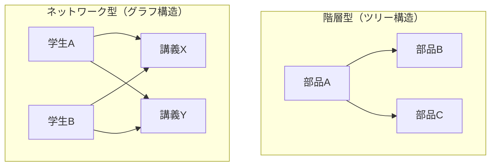

## はじめに

本シリーズ『人類が滅んでも使えるORM』をお手に取っていただきありがとうございます。

本シリーズは、ORマッパー（とその周辺領域）についての技術同人誌シリーズです。この本は当初、ORMの歴史から課題やコンポーネントの整理、そして実装までを扱う予定でしたが、あまりに範囲が広いため分冊版として少しずつ個人出版されることになりました。そのORMの歴史の**さらに**一部がこの書籍、というわけです。

### データベースはアプリケーションと一緒にいるときに輝く

わたしはデータベース技術が好きです。いろんな技術があり歴史もあり研究する人も多い、一大技術領域と呼んで良いでしょう。わたしが思うに、この大変面白いデータベースがもっとも面白いのは、アプリケーションと一緒にいる時です。

以上でデータベースがアプリケーションと一緒にいる時にとても面白いという点については、一定納得いただけたかと思います。このジャンルには良い議論が多く、大変役に立つよい書籍があります。ただそのいっぽうで、大きな課題があるとも私は考えています。それは、**役に立つ書籍がある一方で、役に立たない書籍がない**ことです。

### 今回扱う範囲：1980年代〜1990年代半ば

以上のような理由で、本シリーズでは歴史を大切にしながら、データベース系ミドルウェアが解決した課題とその解決方法を解説していきます。具体的には1982年から1996年あたりに展開したEmbedded SQLとODBC（Open Database Connectivity）というふたつの製品を解説します。

## 第一章：Embedded SQLの時代

この章ではEmbedded SQLという技術について解説します。Embedded SQLはRDBの商用化とともに登場した、プログラミング言語とRDBを繋ぐ初めての技術です。

## 第一節：RDBの登場とEmbedded SQLの歴史

この節では長い人類の歴史をRDBの誕生という観点で洗います。
これから解説する内容はざっくりと以下の年表にある通りです。

| 年        | 出来事                             |
| -------- | ------------------------------- |
| 1880     | ホレリスのパンチカード                     |
| 1964     | BDAM/ISAM（IBM OS/360）           |
| 1968     | IMS正式稼働                         |
| 1970     | コッドのリレーショナルモデル論文                |
| 1979     | Oracle Version 2（世界初の商用SQL-RDB） |
| 1982     | IBM DB2 + Embedded SQL          |

### 1-1-1. 前データベースの時代

#### 記録の歴史、その始まり

人類がデータを記録してきた歴史は、想像を絶するほど古くから続いています。本書の冒頭で触れた4万年前の洞窟壁画をはじめとして、石板や粘土板、パピルス、羊皮紙、木管・竹管、そして紙へと、記録の媒体は時代とともに変化しながらも、「何かを書き留める」という本質的な行為は長く変わりませんでした。

#### ホレリスの会社：ハードなソフトウェア

ホレリスはこの成功を足がかりにTabulating Machine Company社を設立します。その後複数の会社との合併を経て社と改名し、後継の社長が社名をInternational Business Machinesと変更しています。

### 1-1-2. データベースの誕生

[[2026.3.20_DB誕生の整理]]
ここからはデータベースの歴史について考えてみましょう。

#### 階層型・ネットワーク型データベースの登場

ファイルアクセス方式が確立されたのと同時期の1963年に、GeneralErectrics社のチャールズ・w・バッハマンによりIDS（Integrated Data Store）が発明されます。これはネットワーク型データベースであり、史上初めてのDBMSでした。

しかし、これらのデータベースにはある根本的な問題が残っていました。データの物理的な格納構造とアクセス方法が密接に結びついており、データの扱い方を変えたければシステム全体の再設計が必要になってしまうのです。
